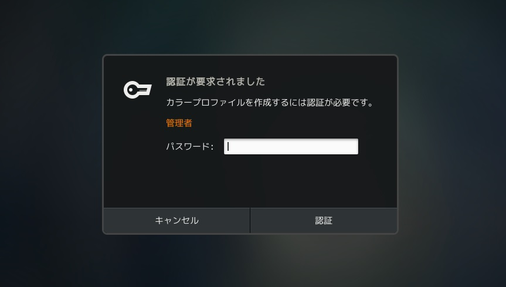
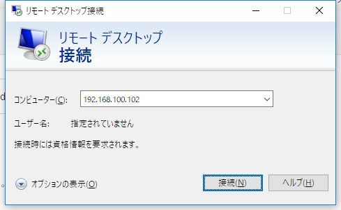
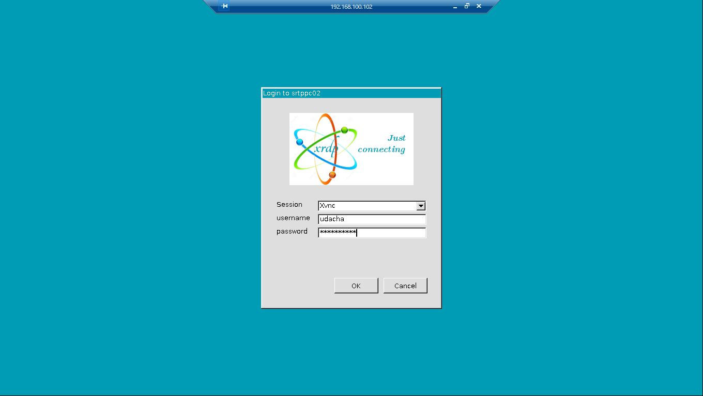
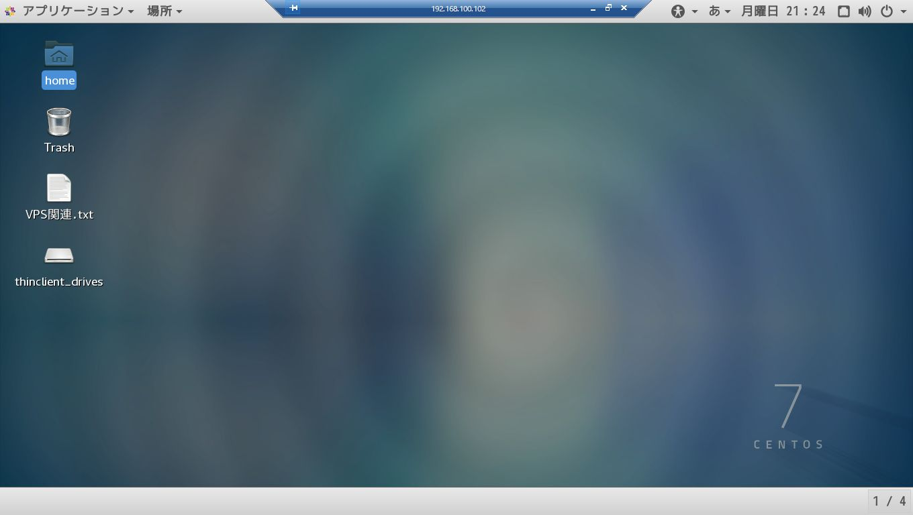

# {{this.$page.frontmatter.title}}

<span style="color: #ff0000;">20180415 ｢SELinuxのポリシー作成(geoclue_t→unconfined_service_tへのアクセス制御緩和)｣と｢カラープロファイルを作成するには認証が必要です｣の解消を追記しました。</span>

{{this.$page.frontmatter.description}}

<!--more-->

## WindowsからLinuxへリモートGUI操作を行う手段

- X11のsshポートフォワーディング
- VNCサーバをたてる
- xrdpサーバをたてる

1のX11のsshポートフォワーディングは古くからある鉄板だけど、Tera term等の仮想端末からLinux機へsshでつないでおき、X11の通信に必要な6000番ポートの通信をトンネルするというちょっとめんどくさい手順を踏む必要があるし、クライアントのWindows側にXサーバをインストールする必要があり、複数Windows機を扱う身からするとこれまためんどくさい。

2はLinux機にVNCサーバをインストールし、その5900番ポートへWindows機にインストールしたVNCクライアントから接続するといった流れ。こちらもクライアント側にソフトウェアをインストールする必要があるため却下。

3はLinux機にxrdpサーバをインストールし、RDPを扱えるようにする流れ。Windows機からは標準のリモートデスクトップ(mstsc.exe)でつなぐだけでOK。描写速度も申し分ないとのこと。これでいきましょう(Linux機からLinux機へGUIログインしたくなったらどうすんだという懸念は残りますが……)。ちなみに内部的にはVNCを利用しており、それをrdpに変換してくれるのがxrdpだとのこと。

## 要件

- CentOS Linux release 7.3.1611 (Core)
- 3.10.0-514.26.2.el7.x86_64

いつものお約束。Basic Serverでインストールしたこの環境に`sudo yum groupinstall "GNOME Desktop"`を行い、スタンドアロンではGNOME環境が扱えるようになっていることを前提とします。

## xrdpのインストール

EPELリポジトリからインストール

```bash
[udacha@srtppc02 ~]$ sudo yum install xrdp --enablerepo=epel
```

## 起動&自動起動設定

```bash
[udacha@srtppc02 ~]$ sudo systemctl start xrdp
[udacha@srtppc02 ~]$ sudo systemctl enable xrdp
```

## ファイアウォールあなあけ

```bash
[udacha@srtppc02 ~]$ sudo firewall-cmd --permanent --zone=myfirewall --add-port=3389/tcp
[udacha@srtppc02 ~]$ sudo firewall-cmd --reload
```

## SELinuxのポリシー作成(geoclue\_t→unconfined\_service_tへのアクセス制御緩和)

xrdpインストール後、/var/log/audit/audit.logを見ると上記アクセスがdeniedされたというログがログインの度に出ることに気づきました。こんな感じ。

```bash
[udacha@srtppc02 ~]$ sudo cat /var/log/audit/audit.log | grep denied
type=AVC msg=audit(1523801194.423:18269): avc: denied { search } for pid=30593 comm="geoclue" name="27987" dev="proc" ino=412386 scontext=system_u:system_r:geoclue_t:s0 tcontext=system_u:system_r:unconfined_service_t:s0 tclass=dir
type=AVC msg=audit(1523801197.190:18272): avc: denied { search } for pid=30593 comm="geoclue" name="30546" dev="proc" ino=1027910 scontext=system_u:system_r:geoclue_t:s0 tcontext=system_u:system_r:unconfined_service_t:s0 tclass=dir
```

geoclue_tというのは位置情報認識モジュールが利用するドメイン。ネットを漁るとどうやらVNC周りのリソースに対するSELinuxポリシーにバグがあるらしい。

参考：
  
<https://bugs.centos.org/view.php?id=13878>

プロセス周りを見てみるとやっぱりどうもそうっぽい。

```bash
[udacha@srtppc02 ~]$ ps -efZ | grep unconfined_service_t | grep geo
system_u:system_r:unconfined_service_t:s0 udacha 3872 3866 0 Apr15 ? 00:00:01 Xvnc :17 -auth .Xauthority -geometry 1920x1080 -depth 32 -rfbauth /home/udacha/.vnc/sesman_udacha_passwd:17 -bs -nolisten tcp -localhost -dpi 96
system_u:system_r:unconfined_service_t:s0 udacha 27783 27781 0 Apr07 ? 00:00:04 Xvnc :10 -auth .Xauthority -geometry 1364x768 -depth 32 -rfbauth /home/udacha/.vnc/sesman_udacha_passwd:10 -bs -nolisten tcp -localhost -dpi 96
```

鬱陶しいのでSELinuxのポリシーを作成します。というわけでまずはSELinuxのポリシー作成。ログみながら試行錯誤するとこうなりました。厳密にやるならunconfined\_service\_tじゃなくてきちんとVNCにタイプを定義しないといけない。unconfined\_service\_tはわりとゆるゆるな権限らしいです。

```bash
[udacha@srtppc02 ~]$　vim myxrdp.te
module myxrdp 1.0;
require {
 type geoclue_t;
 type unconfined_service_t;
 class dir { search };
 class file { read open getattr };
}
allow geoclue_t unconfined_service_t:dir { search };
allow geoclue_t unconfined_service_t:file { read open getattr };
```

続いてポリシーのコンパイル。

```bash
[udacha@srtppc02 ~]$ sudo make -f /usr/share/selinux/devel/Makefile
```

最後にポリシーのインストール。

```bash
[udacha@srtppc02 ~]$ sudo semodule -i myxrdp.pp
```

これでよし。

## ｢カラープロファイルを作成するには認証が必要です｣の解消

xrdpにログインする際、毎度こんな画面が表示されます。



別にこれ自身はキャンセルで回避できて、それで何か困った現象が起こるわけでもないんだけどなんだか気持ち悪い。なにかっつうとcolordのPolicyKitの権限が足りないという`gnome-settings-daemon`のバグだとのことで、ずっと放置されてるみたい。

参考：
  
<https://bugzilla.redhat.com/show_bug.cgi?id=1149893>
  
<https://www.centos.org/forums/viewtopic.php?t=59312>

二番目の参考ページにも書いてますが、回避策はこれ。PolicyKitに新しいルールを追加する。

```bash
[udacha@srtppc02 ~]$ sudo vim /etc/polkit-1/localauthority/50-local.d/allow-colord.pkla
[Allow colord for all users]
Identity=unix-user:*
Action=org.freedesktop.color-manager.create-device;org.freedesktop.color-manager.create-profile;org.freedesktop.color-manager.delete-device;org.freedesktop.color-manager.delete-profile;org.freedesktop.color-manager.modify-device;org.freedesktop.color-manager.modify-profile
ResultAny=yes
ResualtInactive=auth_admin
ResultActive=yes
```

## Windows機から接続

以上で設定はおわり。超簡単。win + Rからmstsc.exeを起動し、Linux機に接続。



xrdpのパスワードを求められます。何もいじってなかったら適当なUNIXユーザでOK。



ほんでログイン完了。



無事Linux機へWindows機からRDP接続できました。ちょこっと遊んでみましたが速度は申し分なし。設定も簡単。いうことないです。もちろんRDPなのでインターネット経由では使えないけどね。

## 参考

- [qiita n-yamanaka xrdp][1]
- [CentOS 7 – General Support xrdp – pop-up – authentication is required to set the network proxy][2]
- <https://bugs.centos.org/view.php?id=13878>
- <https://bugzilla.redhat.com/show_bug.cgi?id=1149893>
- <https://www.centos.org/forums/viewtopic.php?t=59312>

 [1]: http://qiita.com/n-yamanaka/items/653af5cdac63721ff074
 [2]: https://www.centos.org/forums/viewtopic.php?t=57696
