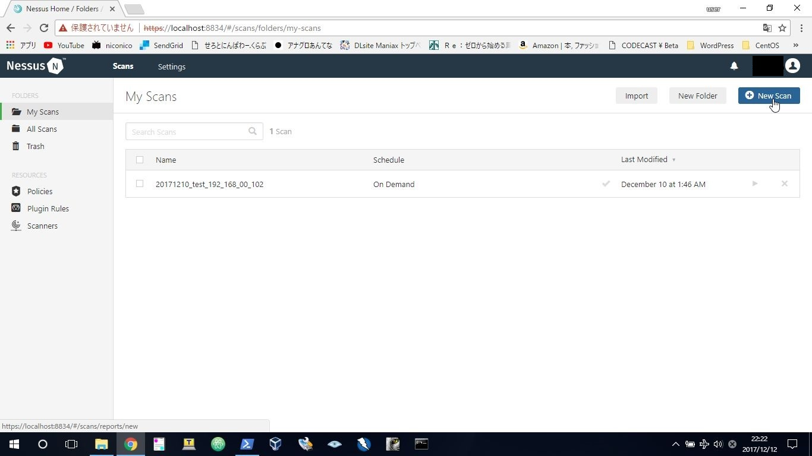
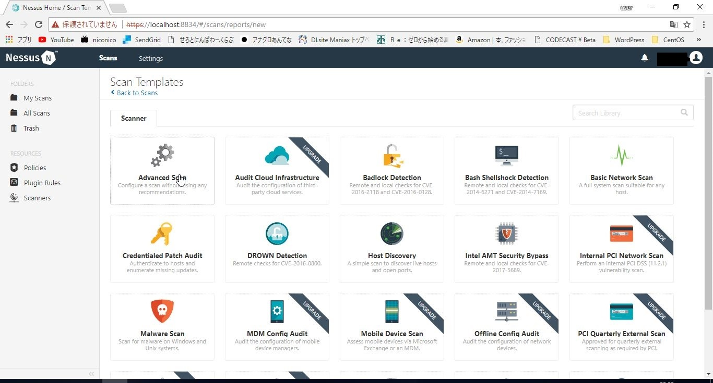
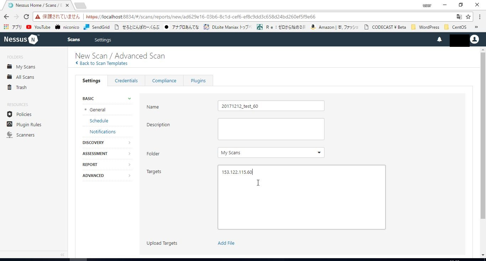
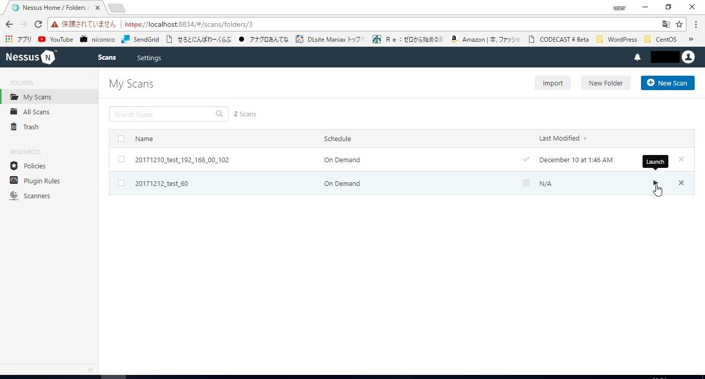
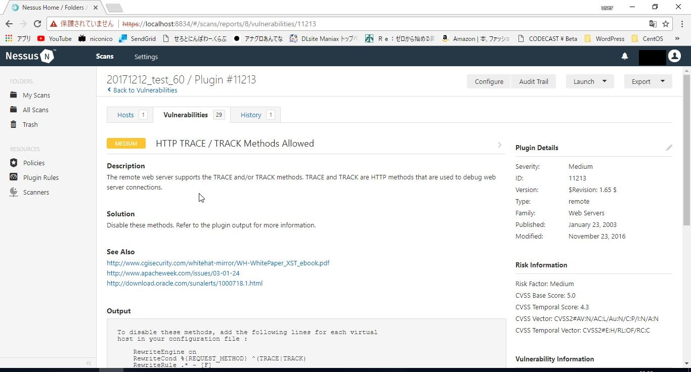

# {{this.$page.frontmatter.title}}

<CategoriesAndDate/>

{{this.$page.frontmatter.description}}

<!--more-->

## 脆弱性診断ツールの分類

脆弱性診断ツールには多種多様なものがあります。私が知っている範囲で書くと、まずはエージェント型とネットワーク型の別。エージェント型は診断対象の機器に専用のソフトウェアを入れ、サーバの内部から調査するもの。ネットワーク型は外部からネットワーク越しに診断対象機器にアクセスして診断するもの。外部へ公開しているサービスの脆弱性を利用して内部に侵入するのが一般的なシナリオである(し、エージェント型はわけわからんくらい脆弱性出てどこから何をすればいいかになる)ため、普通はネットワーク型の診断で十分です。

ネットワーク型の診断ツールにはプラットフォーム型とWebアプリケーション型があります。プラットフォーム型は、診断対象機器へポートスキャンを行い、空いているポートから得られるバナー情報から、脆弱性のあるバージョンのソフトウェアを使っていないか、脆弱性のあるアクセス方法を許していないかを見る基本的に非破壊型のものです。Webアプリケーション型はその名の通りWebAPに特化したもので、例えばSQLインジェクションやXSSなどを実際に実行する基本的に破壊型のものです。

今回書くNessusはネットワーク型かつプラットフォーム型の診断ツールとして利用します。エージェント型の機能も持っていますが使いません。

## Nessusのライセンス入手

NessusはOSSのOpenVASからフォークした商用ソフトウェアですが、個人利用かつ16IPまでなら無料で診断できるHomeエディションがあります。下記のURLにアクセスし、名前とメアドを入力すると、メールでアクティベーションコードが通知されます。

<https://www.tenable.com/products/nessus-home>

## Nessusのインストール

上記の画面で名前とメアドを入れたらNessusのダウンロード画面が表示されます(下記のURLからアクセスしても大丈夫です)。今回はMS Windowsの64bit版をダウンロード。

<https://www.tenable.com/products/nessus/select-your-operating-system>

インストーラをダウンロードしたらダブルクリックで実行。インストールパラメータは基本的に全部デフォルトでOKですが、途中でWinPcapというパケットキャプチャをインストールするか聞かれるところに要注意。NmapにてNpcapというWinPcapフォークをインストールしている場合に競合するので、Npcapをアンインストールしてください。WireSharkに付帯してきたWinPcapとNpcapでは問題なかったんだけどな。

Nessusはローカルホストで稼働するWebAP型管理コンソールを持ちます。インストールが完了したらセットアップ用ブラウザが開きます。Connect Via SSLをクリックするとSSL通信が始まります。自己証明書エラーが出るのでブラウザごとに適当にやりすごす。アクティベーションコードを入力したり、Nessusのユーザ名、パスワードを決定したりするとセットアップが始まります。このときに最新の検査項目がインストールされます。

完了するとこんなログイン画面が表示されます。ユーザ名、パスワードを入力してサインインします。


## Nessusの診断実施方法

サインインしたら右上のNew Scanをクリック。



左上のAdvanced Scanをクリック。



Settings→BASIC→GeneralタブのNameに適当なスキャン名、Targetsに診断対象のIPアドレスを入力。



Settings→DISCOVERY→Ports→Port scan rangeを1-65535に設定。TCPのフルスキャンを行います。なお、UDPもフルスキャンしたい場合は本画面の下のほうにチェックを入れるところがあります(とんでもない時間かかりますが)。


ここまで入力したら画面下部のSaveをクリック。診断する内容が保存されます。下記の画面に戻ったら、入力したスキャン名の右のほうにある再生ボタンをクリック。マウスオーバーするとLaunchと表示されます。



数十分～数時間待つと完了。こんな感じで脆弱性一覧が表示されます。Highのリスクの脆弱性はなくてよかった。


脆弱性をクリックすると詳細画面にうつります。ここで何がまずいのか確認し、対処する/しないを考えます。基本的にInfoレベルの脆弱性は対処しなくてOK。



以上。結局何に対処するのか、どう対処するのか考えるのは人間ですが、ツールを使うと網羅的に一通り舐めてくれるのが便利です。

## 脆弱性への対処

今回でたLowレベルとMidiumレベルの脆弱性には対処しておきました。

まずはMidiumレベルのHTTPサーバのTraceメソッドについて。HTTPメソッドの中のTRACEメソッドを有効にしていると、クロスサイトトレーシングという攻撃方法が可能になるそうです。TRACEメソッドはHTTPリクエストをそのままHTTPレスポンスとして返してくれというメソッドであるため、これとXSSを組み合わせると、アクセスした人のHTTPリクエストをそのまま攻撃者へHTTPレスポンスとして返すことができ、CookieやAuthorizationヘッダを盗聴することができるようです。ただ、これは現在主要なブラウザでは対策が取られているようなので、大した問題ではないとのこと。一応サーバ管理者としてきちんと対策しておきます。

Apacheなら対策はhttpd.confに下記を記載してリロードするだけ。

```bash
TraceEnable off
```

続いてLowレベルのSSHサーバのCBCを利用した暗号スイートについて。Cipher Block Chainingはブロック暗号であり、ブルートフォースで1バイトずつ複合が可能な攻撃手法が複数存在しているとのこと(POODLE、Padding Oracle Attack、BEASTなど)。基本的にTLS1.2を利用していれば問題ないそうですが、念のため無効化しておきます。

sshコマンドでsshdが利用可能な暗号化方式を確認。

```bash
$ ssh -Q cipher
3des-cbc
blowfish-cbc
cast128-cbc
arcfour
arcfour128
arcfour256
aes128-cbc
aes192-cbc
aes256-cbc
rijndael-cbc@lysator.liu.se
aes128-ctr
aes192-ctr
aes256-ctr
aes128-gcm@openssh.com
aes256-gcm@openssh.com
chacha20-poly1305@openssh.com
```

ちなみにarcfourも脆弱なので除外したほうがいいです。なので、ここからarcfourとcbcを含まないものをsshd_configにて指定。以下のコマンドで列挙できます。

```bash
ssh -Q cipher | egrep -v ‘cbc|arcfour’ | sed -z ‘s/\n/,/g’
```

sshd_configへの設定時にはカンマ区切りでスペースはつけないこと。

```bash
Ciphers aes128-ctr,aes192-ctr,aes256-ctr,aes128-gcm@openssh.com,aes256-gcm@openssh.com,chacha20-poly1305@openssh.com
```

そのあとでsshdリロード。

## 所感

セキュリティの細かい話になると｢だそうです｣「とのこと」が多くなって知識不足を感じます。きちんと理解したいけど、｢何をどこまでやるか｣が常に付きまとう。｢どうなりたいのか｣をもっと明確にしないといけない。
