# {{this.$page.frontmatter.title}}

<CategoriesAndDate/>

プラットフォーム脆弱性診断に続き今度はWebAP脆弱性診断。今回はOWASP ZAP(Open Web Application Security Project Zed Attack Proxy)というOSSのツールを使います。このツールは[脆弱性診断研究会][1]さまの講習会で勉強させてもらいました。<!--more-->

## OWASP ZAPとは

ローカルプロキシ型WebAP脆弱性診断ツール。診断用PCにインストールしておき、プロキシとして動作することで、診断用PCのブラウザの操作を中継して情報収集、攻撃実行を行います。

[人] -> [ブラウザ] -> [ZAP] -> [診断対象WebAP]

診断できる内容はSQLインジェクション、OSコマンドインジェクション、ディレクトリトラバーサル、XSS、CSRFなどなど。

## インストール

ここからダウンロードしてインストール。今回はWindows (64) Installerを利用。バージョンは2.7.0でした。なおJVMで稼働するアプリケーションなのでJREを別途インストールしておく必要があります。

<https://github.com/zaproxy/zaproxy/wiki/Downloads>

## 注意点

WebAP診断をやる際に絶対に注意しなければならないことは二つ。意図しない他のサーバに攻撃をしないこと。WebAPを破壊してしまわないこと。この二つは使い方の文中で詳しく述べます。

## 使い方

* ZAP起動&セッションの作成
* プロテクトモードへの変更
* ZAPの待ち受けIP&ポートの指定
* クローリング設定
* 同時スキャンホスト数設定
* スキャンポリシーの作成
* ブラウザへのプロキシ設定
* ブラウザから診断対象への手動アクセス
* 診断対象をコンテキストへ追加
* 診断実行

### ZAP起動&セッションの作成

ZAPを起動すると、まずセッションの保存方法をどうするか聞かれます。ZAPは診断実行ごとに4つのセッションファイル(\*.session\*)を生成し、情報を格納します。これをどこに保存しておくかを指定します。これら4つのうち一つでも欠けると動作しなくなるので、管理しやすいよう｢保存先のパスとファイル名を指定してセッションを保存｣を選択し、毎回手動で保存先パス、ファイル名を指定することをおすすめします。

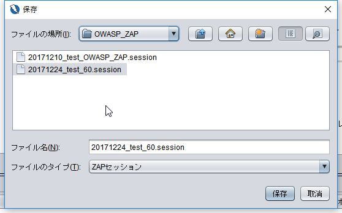

ここから診断前のパラメータ設定を行います。

### プロテクトモードへの変更

まず第一にすることこれ。左上のモードをクリックして選択。ZAPはWebページをクローリングし、自動でリンクを辿っての診断を行いますが、自分の管轄外のドメインへのリンクも辿ってしまうとそこに攻撃を実行してしまいます。プロテクトモードでは、各Webページに診断を実行する前に必ず手動での承認が必要になるため、意図しない他のページへの攻撃実行を防ぎます。

### [ツール] -> [オプション]の設定

各種設定をここで行います。

### ZAPの待ち受けIP&ポートの指定

[Local Proxies]タブにて、プロキシとして待ち受けるIPとポートの指定。今回はローカルプロキシとして稼働させるため、アドレスは127.0.0.1にします。ポートは被らなさそうなものを適当に。今回は講習会で使った57777で。

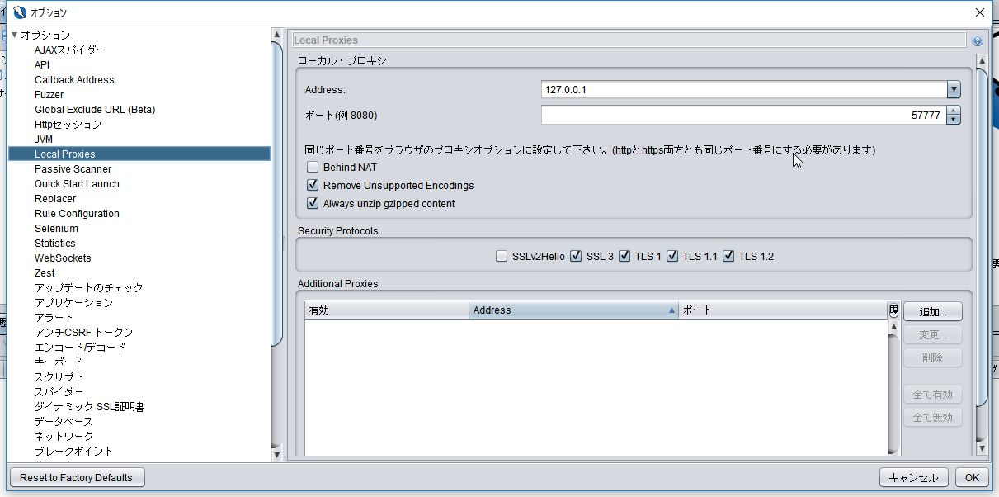

### クローリング設定

[スパイダー]タブの[クロールする最大の深さ]で、診断対象の画面から何階層リンクを掘るか設定。これは診断対象のWebAPの作りによります。今回は3に。また、同画面の[並列スキャンスレッド数]は、クライアント/サーバ双方の負荷軽減のため、基本的に1に。

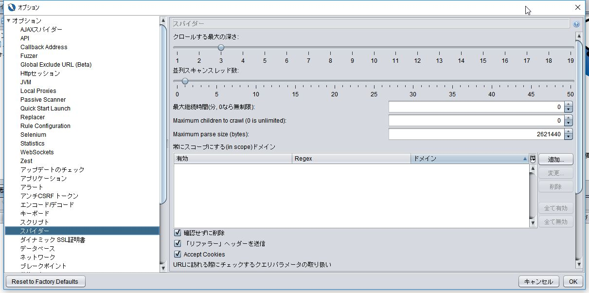

### 同時スキャンホスト数設定

[動的スキャン]の[並列スキャンするホスト数]は基本的に1に。複数ホストを並行してスキャンしているときにクライアントないしはサーバがクラッシュすると、原因の切り分けが難しくなります(お仕事で似たようなことがありました)。[並列スキャンスレッド数]は必ず1に。複数スレッドを立てて診断を行っても、スレッド間のセッション情報の同期ができないため、適切な診断を行えません。[スキャン中のミリ秒単位の遅延]はまずは1000に。下げるほど診断スピードは上がりますが、下げすぎるとパケットを拾いきれずにタイムアウトエラーとなる可能性があります。

ここまでで[ツール] -> [オプション]の設定はおわり。

### スキャンポリシーの作成

[ポリシー] -> [スキャンポリシー] -> [追加]を押して今回診断するポリシーを作成します。

スキャンポリシーの全体設定画面で、[ポリシー]の部分にポリシー名を入力。[カテゴリ]の表では、｢しきい値｣と｢強度｣を入力します。今回は[クライアント・ブラウザ]以外はすべて[low]にします。[クライアント・ブラウザ]は別途プラグインの追加インストールが必要な診断であり、今回はやりません。

* しきい値：ZAPが診断対象を｢異常｣だと判断する基準。下げるとちょっとしたことでも脆弱性だとレポートし、上げるとちょっとやそっとじゃレポートしません。今回は[low]に。なお、本値が[オフ]だと｢診断をしない｣という意味になります。
* 強度：ZAPが行う攻撃の高度さ。[high]だとWebAPのDBを破壊しかねないので、[low]を強く推奨。

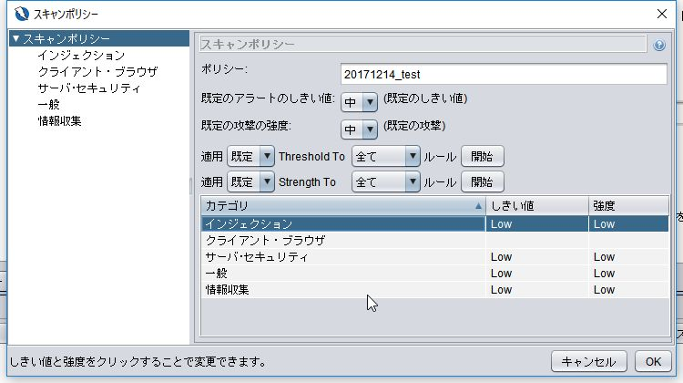

これでインジェクション系、サーバセキュリティ系、一般系、情報収集系の全ての診断をしきい値low、強度lowで行う設定ができました。各系でどんな診断をするのかは左ペインから見れます。個々の診断のしきい値、強度のみ変更することもできます。今回はいじりません。

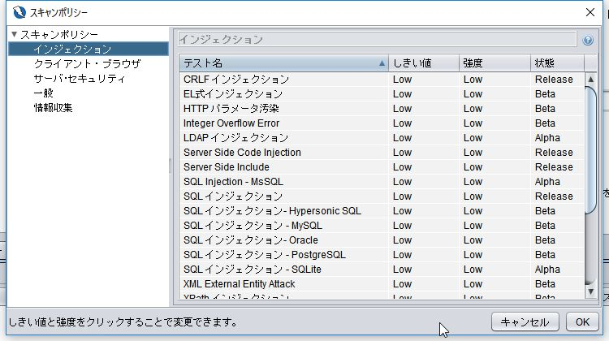

設定が終わったら[OK]をクリック。

### ブラウザへのプロキシ設定

ブラウザがZAPを経由してインターネットアクセスするように変更します。アドレスは127.0.0.1、ポートは本手順の通りだと57777になります。

### ブラウザから診断対象への手動アクセス

ブラウザを起動し、ZAP経由でも普通にインターネットアクセスができることを確認します。https対応のサイト相手だと、ZAPの仕組み上ZAPがルート認証局となった証明書をブラウザに返し、十中八九ブラウザが警告出すので、ブラウザごとの対処法を調べて実行する。対処ができないブラウザ(Chromeとか)の場合、ZAPの証明書を`[ツール] -> [オプション] -> [ダイナミックSSL証明書]`から保存してインストールする。

### 診断対象をコンテキストへ追加

ブラウザから普通にアクセスできることを確認したらZAPの画面に戻る。左ペイン[サイト]内に診断したいサイトのURLが表示されていると思うので、`[右クリック] -> [コンテキストに含める] -> [New Context]`をクリック。このコンテキストに含めるという作業がプロテクトモードの場合必要になります。

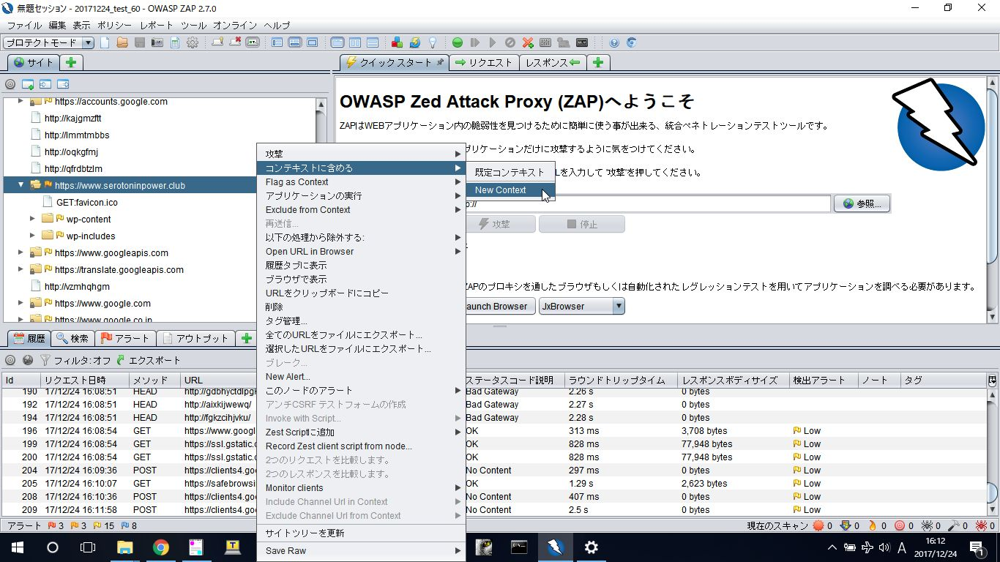

するとセッション・プロパティ画面が開きます。コンテキストとは複数のURLをまとめたものです。コンテキストがすべて自分の管轄下にあるかを確認します。今回は`https://www/serotoninpower/club.*`]`というコンテキストが表示されています。本FQDNはすべて私の管轄下にあるため、診断を実行しても問題ありません。[OK]をクリックします。

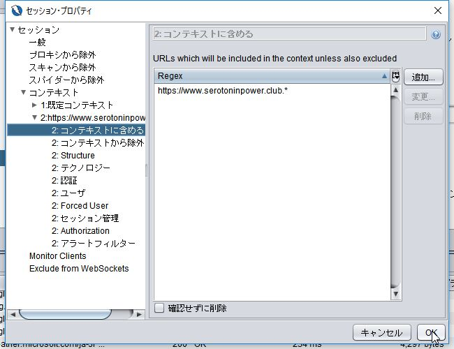

### 診断実行

コンテキストに含めると、左ペインに表示されているURLのアイコン(フォルダ)の表示が変わります。二重丸がついたような感じです。これで診断準備完了。URLを[右クリック] -> [攻撃] -> [動的スキャン]をクリック。

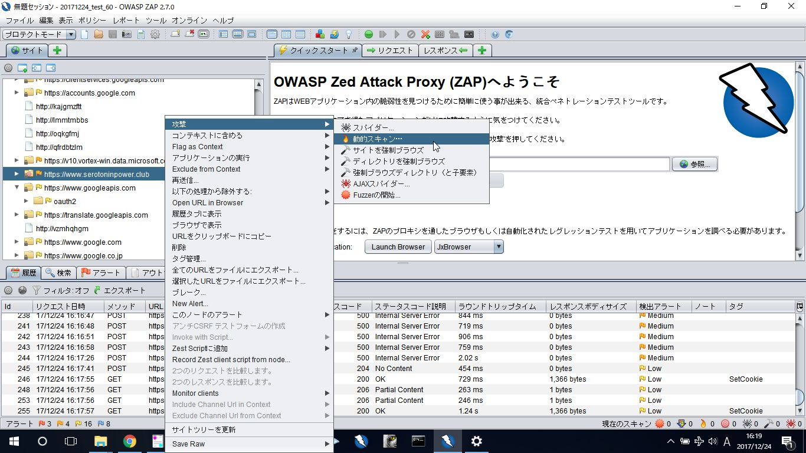

今回は[開始位置]をルートにしました。ポリシーは先ほどつくったもの、コンテキストは先ほど設定したものを入力します。[詳細オプションを表示]はクリックしてみましたがよくわからなかったのでそっ閉じ。[スキャンを開始]をクリックします。

すると下ペインの[動的スキャン]に進捗情報がパーセントで表示され、スキャン内容がずらーと出力されます。数十分～数時間待つべし。

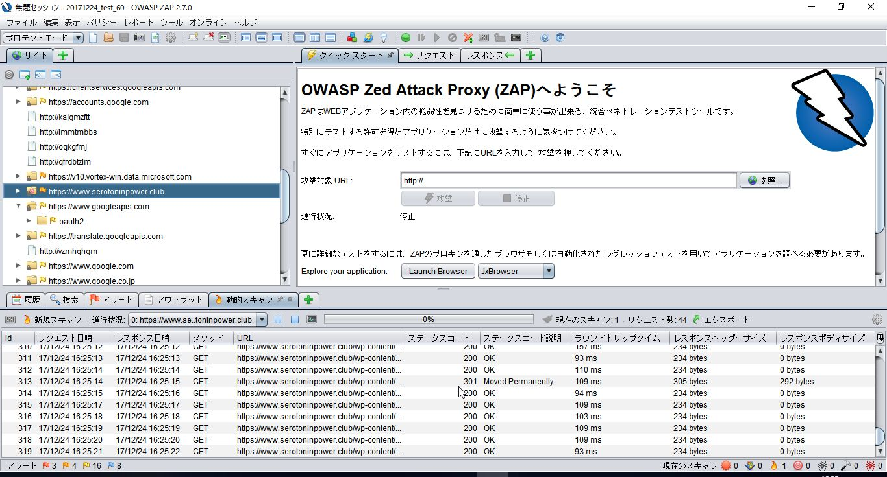

## 診断結果

進捗が100%になったらおわり。下ペインのアラートタブに脆弱性一覧が出ています。

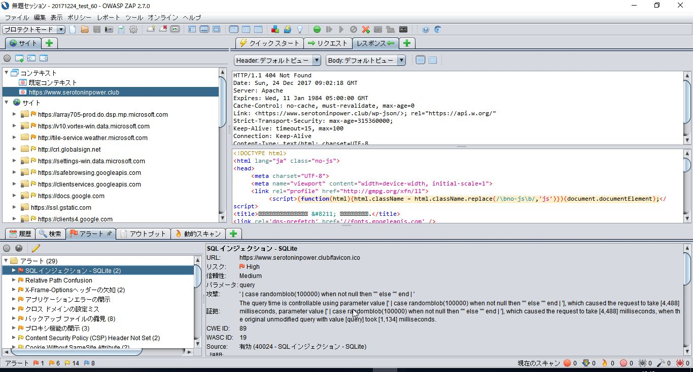

レポートの出力は画面上部の[レポート]からいけます。今回はHTMLレポートを生成してみました。あんまり見やすくはない。

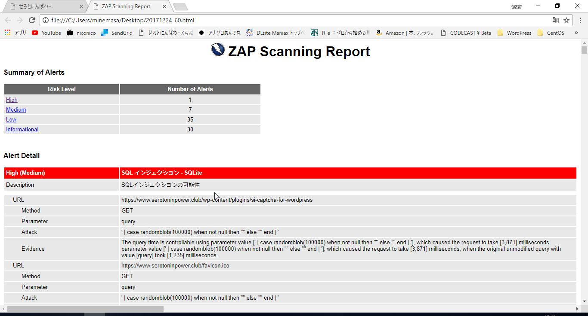

ざっと中身を見ましたが、Webサーバレベルで対応できそうな脆弱性がいくつかあったので対処しておきたいと思います。APレベルになるとわからん。WordPressのプラグインの一つにSQLインジェクションの脆弱性が出てるので、別なプラグイン使おうかなというレベル。

## 所感

メリークリスマス！

 [1]: https://security-testing.doorkeeper.jp/
