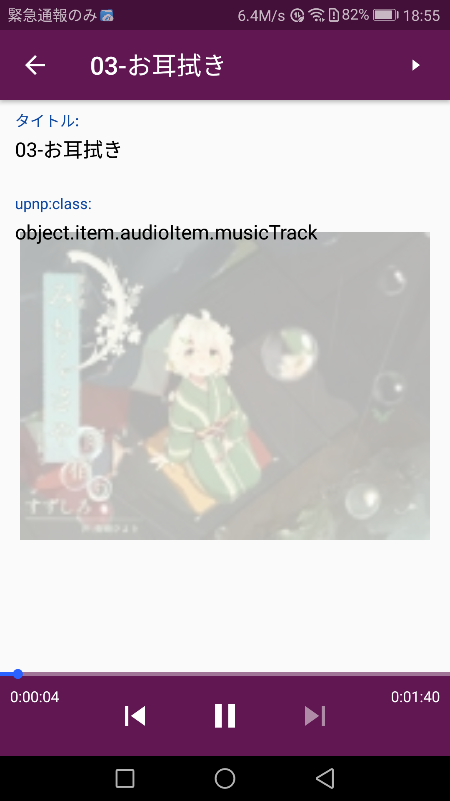

# {{this.$page.frontmatter.title}}

<Date/><ShowCategoriesOfPost/>

<span style="color: #ff0000;">20181026　DB作成のパーミッション周りの記述誤り・補足を修正・追加<br /> 20190617　DB再作成をバッチ化<br /> </span>

[以前の記事で、mpdを使いミュージックサーバを作りました。][1]これはCentOS7に直結されたスピーカーから音楽を再生するミュージックサーバです。今度はCentOS7から音楽を飛ばし、他のデバイスで音楽を再生できるような環境を作ります。この音楽を飛ばすプロトコルがDLNA。音楽以外に動画や写真なんかも飛ばせます。

<!--more-->

きっかけは寝るときの音楽再生環境を何とかしたかったから。これまでずっと寝るときは、日中使うWalkmanで音楽を聴いていたんですが、昼使うものを夜使うと充電がめんどくさい。お古のAndroidがあったのでそっちを寝るとき専用にしようにも、いちいちAndoroidに音楽をコピーするのがめんどくさい。じゃあ音楽が置いてあるファイルサーバから、Andoroidに直接音楽ストリーミングできればいいじゃんってことで。

それに使うのが使うのがReadyMedia。旧称MiniDLNA。Netgear社の社員が作ったOSSで、NetgearのNASには標準搭載されているそうな。

## 環境

ReadyMedia(MiniDLNA)のバージョンは構築後に確認しました。

```bash
$ cat /etc/redhat-release
CentOS Linux release 7.4.1708 (Core)
$ minidlnad -V
Version 1.1.6
```

## ReadyMedia(MiniDLNA)インストール

nux-dextopリポジトリからインストール。依存パッケージ(libFLACなど)導入のためepelリポジトリも同時に参照すべきとのことでしたが、私の環境では依存パッケージは全て導入済みだったため、nux-dextopから本体のみがインストールされました。

```bash
sudo yum install minidlna --enablerepo=epel,nux-dextop
```

ちなみにminidlnaが依存しているパッケージ一覧はこちら。

```bash
$ rpm -q --requires minidlna
/bin/sh
/bin/sh
/bin/sh
/bin/sh
config(minidlna) = 1.1.6-1.el7.nux
libFLAC.so.8()(64bit)
libavformat.so.56()(64bit)
libavformat.so.56(LIBAVFORMAT_56)(64bit)
libavutil.so.54()(64bit)
libavutil.so.54(LIBAVUTIL_54)(64bit)
libc.so.6()(64bit)
libc.so.6(GLIBC_2.11)(64bit)
libc.so.6(GLIBC_2.14)(64bit)
libc.so.6(GLIBC_2.15)(64bit)
libc.so.6(GLIBC_2.2.5)(64bit)
libc.so.6(GLIBC_2.3)(64bit)
libc.so.6(GLIBC_2.3.4)(64bit)
libc.so.6(GLIBC_2.4)(64bit)
libc.so.6(GLIBC_2.7)(64bit)
libc.so.6(GLIBC_2.8)(64bit)
libexif.so.12()(64bit)
libid3tag.so.0()(64bit)
libjpeg.so.62()(64bit)
libjpeg.so.62(LIBJPEG_6.2)(64bit)
libogg.so.0()(64bit)
libpthread.so.0()(64bit)
libpthread.so.0(GLIBC_2.2.5)(64bit)
libsqlite3.so.0()(64bit)
libvorbis.so.0()(64bit)
rpmlib(CompressedFileNames) <= 3.0.4-1
rpmlib(FileDigests) <= 4.6.0-1
rpmlib(PayloadFilesHavePrefix) <= 4.0-1
rtld(GNU_HASH)
shadow-utils
systemd-units
systemd-units
systemd-units
rpmlib(PayloadIsXz) <= 5.2-1
```

## 設定ファイル(minidlna.conf)編集

コンフィグファイルの配置場所は`/etc/minidlna.conf`。編集したのは以下の通り。日本語コメントは私の補足。`*_dir`のディレクトリはuserで指定したユーザが読み書きできるようにしておいてください。

```bash
# port for HTTP (descriptions, SOAP, media transfer) traffic
port=8200  #ストリーミングに使用するポート。コメントアウトして明示。

(略)

# specify the user account name or uid to run as
#user=jmaggard
user=minidlna  #ReadyMediaを実行するユーザ指定。ログインユーザで動かす必要がなければ、minidlnaインストール時に作成されるシステムユーザminidlnaを指定。

# set this to the directory you want scanned.
# * if you want multiple directories, you can have multiple media_dir= lines
# * if you want to restrict a media_dir to specific content types, you
#   can prepend the types, followed by a comma, to the directory:
#   + "A" for audio  (eg. media_dir=A,/home/jmaggard/Music)
#   + "V" for video  (eg. media_dir=V,/home/jmaggard/Videos)
#   + "P" for images (eg. media_dir=P,/home/jmaggard/Pictures)
#   + "PV" for pictures and video (eg. media_dir=PV,/home/jmaggard/digital_camera)
#media_dir=/opt
media_dir=A,/home/samba/share/02_voice
#各メディアが保存されているディレクトリを指定。ディレクトリ名の前に｢A,｣などでメディアの種類を指定。Aが音楽、Vがビデオ、Pが写真。

(略)

# set this if you want to customize the name that shows up on your clients
friendly_name=DLNAServer(192.168.100.102)
#DLNAクライアントに表示するサーバ名

# set this if you would like to specify the directory where you want MiniDLNA to store its database and album art cache
db_dir=/var/cache/minidlna
#minidlnaが使用するDBの場所。コメントアウトで明示。

# set this if you would like to specify the directory where you want MiniDLNA to store its log file
log_dir=/var/log/minidlna
#minidlnaのログを配置するディレクトリ。コメントアウトで明示

(略)
```

## ファイアウォール穴あけ

8200/tcpがストリーミングに利用するポート。1900/udpがSSDP(Simple Service Discovery Protocol)で使用するポート。UPnP(Universal Plug and Play)というプロトコルを使ってクライアントが自動的にDLNAサーバを探しに行くのに使います。

```bash
sudo firewall-cmd --permanent --zone=myfirewall --add-port=8200/tcp
sudo firewall-cmd --permanent --zone=myfirewall --add-port=1900/udp
sudo firewall-cmd --reload
```

## ReadyMedia(MiniDLNA)のDB作成

以下のコマンドでメディアをReadyMediaのDBに登録します。同時に音楽のサムネイルのDB登録なんかもやってくれている様子。<span style="color: #ff0000;">なお、音楽のサムネイル登録はDBを再作成しないとできません(これは20190617にバッチ化しました。後述)。</span>

このコマンドが作成するDBのファイルの所有者は、コマンド実行したユーザになります。これらのファイルは`rw-r–r–`ですので、一般ユーザがDB作成コマンドを実行すると、minidlnadを動かすminidlnaユーザがこれらのファイルに対して書き込み(更新)できなくなります。そのため、DB作成コマンドはminidlnaユーザで実行するようにします。このタイミングでログファイルも生成されます。ログファイルの所有者もコマンドを実行したユーザです。

```bash
$ sudo -u minidlna minidlnad -R
```

再作成が終わったら、<span style="color: #ff0000;">一度ReadyMediaのプロセスを全て落とします。</span>これをやらないとsystemdから見たstatusがFailedになってsystemdから触れない状態になる。

<span style="color: #ff0000;">20181026補足。</span>minidlnad -Rを打つと、DBの新規作成を行うだけでなく、バックグラウンドでサーバプロセスとして稼働もするようです(DBの新規作成だけやって落ちてくれるのが普通の感覚ですよね……)。この-Rによって起動されたminidlnadは、systemdを経由していないのでsystemdの管轄外です。/usr/lib/systemd/system/minidlna.serviceを見ればわかりますが、systemdは｢/usr/sbin/minidlnad -S｣がminidlnaのサービスプロセスだと認識しているからです。

よって、このままsystemctlでminidlnaをstartしようとすると、すでにminidlnad -Rでバインド済みのポートに別プロセスのminidlnadがポートをバインドさせようとして失敗してFailedになります(ただし-Rで起動したminidlnadは生きているため、クライアントからアクセスは可能)。systemdから触れるものはsystemdから統合管理したいため、minidlnad -Rを実施したら、そのバックグラウンドプロセスを殺し、systemdから起動しなおすようにします。

```bash
sudo killall minidlnad
```

<span style="color: #ff0000;">20190617追記: DB更新をバッチ化しました。</span>

[Linuxで指定時間内にログに特定の文字列が現れるかどうかをコマンドで監視する(ReadyMediaのDB更新バッチ)](https://www.serotoninpower.club/archives/754)

## ReadyMedia(MiniDLNA)起動&自動起動

```bash
sudo systemctl start minidlna
sudo systemctl enable minidlna
```

## クライアントからの接続確認

DLNAクライアントアプリはいろいろありますが、私はAndoroidから接続するのに[DMSエクスプローラ][2]を利用しました。インストールし、CentS7と同一NWにつないだ状態で起動すると、自動的にDLNAサーバを探しにいってくれます。


んでサーバを選択して、フォルダから再生したいメディアを選択すると、スマホでメディアが再生できます。



おわり。これで寝るときにWalkmanの電池を消耗せず、かつお古のスマホにわざわざデータを保管することなく、音楽をお古のスマホから聞けるようになりました。

## 参考

* [XEN blog Centos7 ReadyMedia (minidlna)インストール][3]
* [ArchWiki ReadyMedia][4]

 [1]: https://www.serotoninpower.club/archives/283
 [2]: https://play.google.com/store/apps/details?id=net.mm2d.dmsexplorer
 [3]: https://www.sakuraclass.com/archives/224/
 [4]: https://wiki.archlinux.jp/index.php/ReadyMedia#Media_DB_.E3.81.AE.E8.87.AA.E5.8B.95.E6.9B.B4.E6.96.B0
