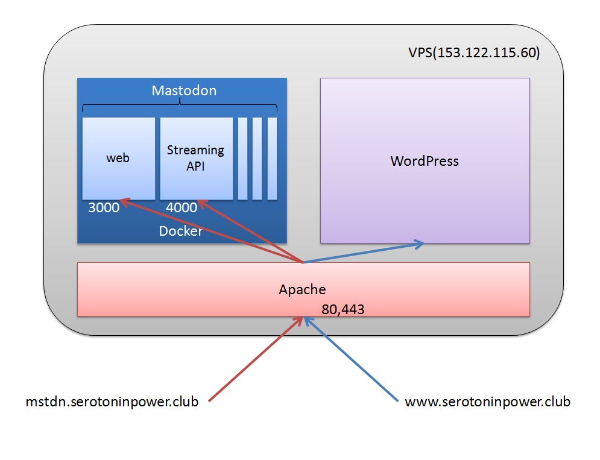

# {{this.$page.frontmatter.title}}

<CategoriesAndDate/>

{{this.$page.frontmatter.description}}

<!--more-->

## 方針の変更

前回投稿した方針を変更しました。

- 既存のサーバ(CentOS 7.3)にDocker環境を構築し、そこにマストドンのコンテナを乗せる

- ~~マストドンとWordPressを同居させるために、nginxをリバースプロキシサーバとして用いる。マストドンへのアクセスはコンテナに、WordPressへのアクセスはApacheに振り向ける(既存のApacheもリバースプロキシ機能を持っているが、SNSのような小さなリクエストを大量にさばくのには不向き)~~

- マストドンとWordPressを同居させるため、既存のWebサーバであるApache 2.4.6をリバースプロキシサーバとしても用いる。

つまりどういうことかというと、

## before


## after



今からMastodon、Dockerに加えてnginxも習得するのは時間的に厳しいと判断。ApacheがMastodonへの少量かつ大量の処理をさばけるか疑問ですが、そうなったらそうなったときで。ユーザー数もそんなに多くならないと思うので大丈夫だと思う。

## 構築手順

## gitのインストール

Mastodon本体をgithubから引っ張ってくるのに使います。インストール後にきちんとインストールできたか確認。

```bash
# yum install git
# git --version
```

## dockerのインストール

Mastodonはdockerコンテナとして動きます。コンテナを用いないインストール方法もあるのですが、dockerのハンズオンがてら今回はdockerで。

```bash
# yum install docker
```

dockerを起動させ、自動起動設定をしておく。

```bash
# systemctl start docker
# systemctl enable docker
```

## Docker-composeのインストール

簡単にいうと、複数のコンテナが協調して動くようなシステムの管理を容易にするツール。Web-DBシステムをコンテナでやろうとすると、起動順序とかを気にしないといけないため長いシェルスクリプトを書かないといけない。そんなのを.ymlファイル一発で設定し、勝手にやってくれるツール。

今回は2017/04/16現在の最新版1.12.0を落としています。

```bash
# curl -L https://github.com/docker/compose/releases/download/1.12.0/docker-compose-`uname -s`-`uname -m` > /usr/local/bin/docker-compose
```

実行権を付与し、きちんとインストールされたか確認。

```bash
# chmod +x /usr/local/bin/docker-compose
# docker-compose --version
```

## マストドンのインストール

git、docker、docker-composeをインストールし、ここまでで下準備は完了。マストドン本体をインストールします。

```bash
# cd "mastodonをインストールするディレクトリ"
# git clone https://github.com/tootsuite/mastodon.git
```

## マストドンの設定

マストドンをインストールしたディレクトリ内にある.env.productionを編集しマストドンの設定を、同ディレクトリ内にあるdocker-compose.ymlを編集しdocker-composeの設定を行います。

```bash
# cd mastodon
```

サンプルファイルがあるので、コピーして編集。

```bash
# cp .env.production.sample .env.production
# vim .env.production
```

コンテナを用いる場合、rediusやdbの設定はデフォルトでOK。まずはドメイン名とhttpsを用いるかどうかを設定する。公式ではhttpsが強く推奨されています。

```bash
LOCAL_DOMAIN=mstdn.serotoninpower.club
LOCAL_HTTPS=true
```

メール周り……後日追記します。

ここでいったん.env.prodctionの編集は終わり。続いて.ymlファイル。

```bash
# vim docker-compose.yml
```

こちらも特に難しい設定はしません。ただし、データの永続化設定はしておいてください。マストドンはデフォルトではデータをコンテナ内に保持します。これが何を意味するかというと、コンテナを落とした場合データが消えるということです。データはコンテナの外に出すようにしましょう。

`## Uncomment to enable DB persistance`と記載されている下の二行と、`### Uncomment to enable REDIS persistance`と記載されている下の二行をアンコメント。

これでデータはコンテナの外に出されます。データの配置場所もここでいじれるので、変更する場合はアンコメントした部分に記載のディレクトリを変更してください。ちなみにAWSのS3上にデータを保存することもでき、それ用の設定項目もありますが、今回は用いません。いったん編集終わり。

## secretの生成

コンテナ間の通信に必要な鍵を生成します。実はここなんなのかよくわかってない。

以下のコマンドを3回叩き、出力された文字列をコピーし、`.env.production`の`PAPERCLIP_SECRET`,`SECRET_KEY_BASE`,`OTP_SECRET`にそれぞれ貼り付け。初回コマンド実行時のみいろいろ走るので時間がかかります。

```bash
# docker-compose run --rm web rake secret
```

## データベースのマイグレーションとアセットのプリコンパイル

以下のコマンドでデータベースをマイグレーション。

```bash
# docker-compose run --rm web rails db:migrate
```

以下のコマンドでアセットをプリコンパイル。ログを見た感じAWS上に保存されている画像データなどを引っ張ってきて、ローカル上で使用できるようにしてるっぽい。

```bash
# docker-compose run --rm web rails assets:precompile
```

## マストドンの起動

コンテナ群のdockerイメージを構築します。起動後に設定ファイルを変更した場合、またこれが必要になります(コンテナ群をstopしてから実行してください)。

```bash
# docker-compose build
```

時間がかかるので待機。終わったらいよいよコンテナ群を立ち上げます。ここで-dオプションをつけないとホストの標準入出力がdockerに持っていかれるので注意。

```bash
# docker-compose up -d
```

けっこう時間がかかります。以下のコマンドで立ち上がっていく様子を見ることができます。

```bash
# docker-compose logs -f
```

ログ出力が止まったらctrl+Cで抜けます。ここまででようやくマストドンが立ち上がります。ただし、まだファイアウォールの設定や、リバースプロキシの設定がのこっています。

## iptablesの設定

私の環境ではファイアウォールにiptablesを使用しています。firewalldを利用されている方は適宜読み替えてください。

dockerがインストールされると、docker仮想ブリッジがホストのアダプタ直結で作成されます。私は外部から直接コンテナへアクセスされたくないので、ホストアダプタからのdocker仮想ブリッジへのアクセスをすべて拒否します。

```bash
# iptables -I DOCKER -i eth0 -j DROP
```

あとは保存してiptablesを再起動。

```bash
# iptables-save > /etc/sysconfig/iptables.save
# systemctl restart iptables
```

## Apacheのモジュール確認

今回は名前ベースのバーチャルホストとしてリバースプロキシし、動かします。httpsでリバースプロキシを行うために必要なモジュールが有効になっているか確認。

```bash
# httpd -M | grep -e ssl -e proxy -e rewrite
```

大抵デフォで必要なものは有効になっていると思いますが、`ssl_module`と`proxy_module`、`proxy_balancer_module`、`proxy_http_module`、`proxy_connect_module`、`proxy_wstunnel_module`、`rewrite_module`有効化されていない場合は有効化しておいてください。

Apacheは設定ファイルを分割できるので、ここからの設定は直接http.confに書くなりconf.dやconf.modules.dに別ファイル作るなりしてください。

## http通信のリバースプロキシ設定

```bash
<IfModule mod_proxy.c>
#フォワードプロキシ無効にして、リバースプロキシを有効に
ProxyRequests Off

<VirtualHost *:80>
#既存のWordPressの方の設定。
#マストドンのほうだけVirtualHostを定義すれば良いわけではなく、一つでもVirtualHostディレクティブを記載するのならば、全てをVirutualHostとして扱う必要がある。
#なお、ここで80番ポートを指定しておかないと、443番ポートまで一緒に処理されてしまうので、ポートにワイルドカードは使用せず80番と指定しておく。
ServerName www.serotoninpower.club
DocumentRoot /var/www/html
</VirtualHost>

<VirtualHost *:80>
ServerName mstdn.serotoninpower.club
#マストドンの方の設定。基本的にhttpsへmod_rewroteを使ってリダイレクトさせる。
#ただし、Let's Encrypt(後述)が使用するファイルのみは書き換えない。
<IfModule mod_rewrite.c>
RewriteEngine on
RewriteRule "^/.well-known/acme-challenge" "-" [END]
RewriteRule "^/(.*)" "https://mstdn.serotoninpower.club/$1"
</IfModule>
</VirtualHost>
</IfModule>
```

## https通信の設定とそのリバースプロキシ設定

conf.d/ssl.confにデフォルトの値が記載されているので、それを利用します。

複数のVirutalHostを定義するために、`<VirtualHost _default_:443>`をコメントアウトし、`<VirtualHost *:443>`に書き換え。

まずは既存のWordPressの方から。サーバーネームとドキュメントルートのみ変更。書く内容はhttpd.confやhttp通信のproxy設定で書いた内容と同じ。

```bash
ServerName www.serotoninpower.club
DocumentRoot /var/www/html
```

あとはデフォルト値でOK。SSLCertificateFileとSSLCertificateKeyFile、SSLCertificateChainFileはssl通信用の鍵を入手したら入力します。

続いてマストドンの設定。上記で編集した`<VirtualHost *:443>`から`</VirtualHost>`までの内容をだばーっとコピペし、その下に貼り付け。それを編集していきます。まずはサーバーネームの編集。

```bash
ServerName mstdn.serotoninpower.club
```

続いてDocumentRootを行ごと削除。SSLCertificateFileとSSLCertificateKeyFile、SSLCertificateChainFileはさっき同様あとで。ここからは新規にディレクティブを追加していきます。

```bash
# フォワードプロキシ無効にして、リバースプロキシを有効に
ProxyRequests off
#SSL通信を用いたプロキシ機能をonに
SSLProxyEngine on
#プロキシ設定。マストドンのWebサーバは3000番ポートで待ち受けているが、
# Streaming API(データを取得し続けるAPI。よくわかってない)は
# 4000番ポートで待ち受けており、またプロトコルもWebSocketであるため、それを明示する。
ProxyPass /api/v1/streaming ws://localhost:4000/
ProxyPass / http://localhost:3000/
ProxyPassReverse /api/v1/streaming ws://localhost:4000/
ProxyPassReverse / http://localhost:3000/
# バックエンドのマストドンがhttpsでリダイレクトを発行するよう指示。
# これがないとリダイレクトが無限ループする。
RequestHeader set X-Forwarded-Proto "https"
```

## SSL証明書の発行

あとひといき。Let's Encryptを利用して無料でSSL証明書を発行してもらいます。

Let's Encryptは80番ポートを利用して証明書発行を行うため、いったんhttpdを止める。

```bash
# systemctl stop httpd
```

EPELリポジトリからcertbotをインストール。これがクライアントとしてLet's Encryptからの証明書の発行を自動化してくれる。

```bash
# yum install epel-release
# yum install certbot
```

証明書を発行。-dオプションを複数つけると、いっぺんに複数ドメインの証明書を要求できる。

```bash
# certbot certonly -standalone -d www.serotoninpower.club -d mstdn.serotoninpower.club
```

メアドを求められるので入力。利用規約に同意。これで証明書の発行が完了。

SSL証明書が発行できたので、さきほどのSSLプロキシ設定のところで後回しにしていた部分を埋める。

WordPress側

```bash
SSLCertificateKeyFile /etc/letsencrypt/live/www.serotoninpower.club/privkey.pem SSLCertificateFile /etc/letsencrypt/live/www.serotoninpower.club/cert.pem
SSLCertificateChainFile /etc/letsencrypt/live/www.serotoninpower.club/chain.pem
```

マストドン側

```bash
SSLCertificateKeyFile /etc/letsencrypt/live/mstdn.serotoninpower.club/privkey.pem SSLCertificateFile /etc/letsencrypt/live/mstdn.serotoninpower.club/cert.pem
SSLCertificateChainFile /etc/letsencrypt/live/mstdn.serotoninpower.club/chain.pem
```

最後にhttpdを起動し、設定を読み込ませて終了。ブラウザから無事アクセスできるか確認してください。

```bash
# systemctl start httpd
```

## まとめ

非常にしんどかった。知識不足を感じた。まだ設定作りこめていない部分もあるので、随時ブラッシュアップしていきます。メールサーバが用意できてアカウントが登録できるようになったらまた通知します。
