# {{this.$page.frontmatter.title}}

{{this.$page.frontmatter.description}}

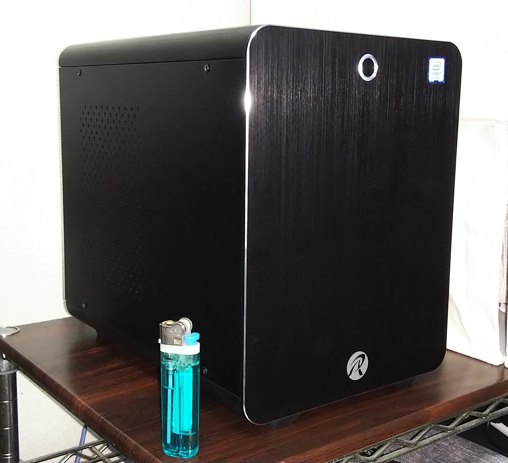

<!--more-->

## ハードウェア構成

構成は次の通り。ESXiはハードウェア要件に厳しいですが、念入りに確認してから購入したため、素のインストールメディアから一発でインストールできました。

|項番|品名|価格|
|---|---|---|
|1|RAIJINTEK METIS PLUS|5,378|
|2|Intel Core i7 8700 BOX|41,482|
|3|ASRock H370M-ITX/ac|12,911|
|4|CORSAIR DDR4-2666MHz VENGEANCE LPX Series 8GB×2枚キット|18,044|
|5|Silverstone 450W SFX 黒 SST-ST45SF-G|9,780|
|6|Crucial BX500 CT120BX500SSD1JP (120GB)|3,425|
|7|Corsair H60-2018- 水冷CPUクーラー FN1190 CW-9060036-WW|7,500|
|8|ENERMAX UCTVS12P-BL|1,804|

合計： 100,324

この構成のポイントは以下の通り。

### 1.mini-itxケース＆マザボによる小型化と、sfx電源、水冷CPUクーラーによるケース内部の省スペース化

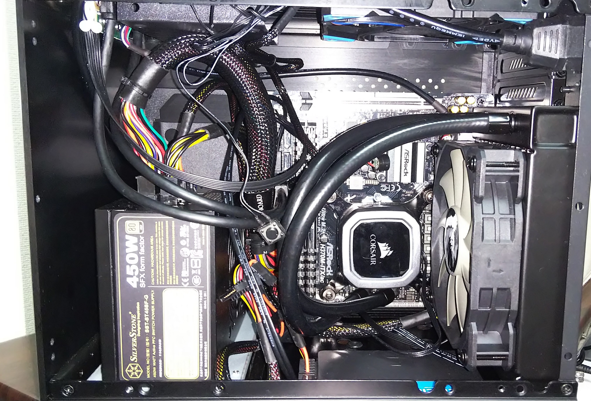

mini-itxはいかんせんケースの中身が寿司詰め状態になります。このケースはATX電源や、160mmの高さまでのCPUクーラーを内蔵できるという触れ込みですが、sfx電源、水冷クーラーを使用することで、あんまり寿司詰めにならないようにしました。これは大正解。こうしなかったらPC完成があと1日遅れていたように思います。なお、配線の汚さははもう諦め。裏配線もできないし。

ちなみに、このケースの説明書では一番最初に電源を取り付ける手順になっていますが大嘘です。電源は最後にしたほうが圧倒的に組みやすいです。一番最初に、全ての線を結線したマザボを組みつけたほうが楽です。

### 2.intel NICが二つあるmini-ITXマザボの採用

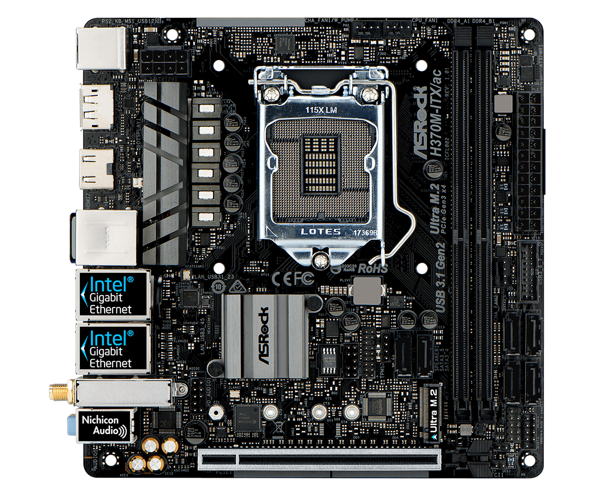

私は本機をLANとSAN(iSCSI)両方に接続したいため、NICは二つほしかったです。NICを増やす方法はいろいろあります。USB-NICを使う方法は、さすがにサーバ用途じゃ誤抜線が怖いし、PCIe増設NICを使う方法は、貴重なmini-ITXマザボのPCIeポートを占有してしまうのがいやなので、やめました。なのでマザボ自体にNICが二枚ある`ASRock H370M-ITX/ac`を採用。なお、本マザボには無線LAN接続用wifiモジュールもついていますが、サーバ用途なので使いません(BIOSから無効化しました)。

このマザボには、intel I219Vと、intel I211ATの2つ異なる種類のintle NICがついています。今回インストールしようとしているESXi 6.5 u2は、両方のNICをサポートしていることを確認済みです。実際に何もしなくても両方とも認識しました。

### 3.6コア12スレッドの第8世代Core i7の採用

最近、第9世代のintel Coreシリーズが発売されました(超品薄らしいですが)。あえて一世代古い第8世代にしたのは、第9世代のCore i7が8コア8スレッドだからです。私はこのESXi上に構築する仮想マシンで、極端に重い処理をさせるつもりはありません。それより、論理コア数を増やすことで、仮想マシン達に割り当てられる仮想コア数を増やしたかったです。そのため、1コアあたりの性能が高いが、SMTが無効化されている8コア8スレッドの第9世代Core i7ではなく、6コア12スレッドの第8世代Core i7を採用しました。

ちなみに第9世代のCoreシリーズとして、8コア16スレッドのCore i9もあるらしいですが、値段を見てそっ閉じ。Core i7までがお財布の限界です。

## ESXiのインストール

### isoイメージのダウンロード

My VMwareにログオンした状態で、公式(<https://my.vmware.com/jp/group/vmware/evalcenter>)にアクセスし、ESXiのisoイメージを持ってきます。My VMwareアカウントを作成する必要はありますが、アカウントの作成、ESXiのダウンロード共に無料です。私は6.5.0 Update2に用事があったのでダウンロード。ダウンロードする際に、ライセンスコードが表示されるのでメモっておきます。

### ISOイメージをUSBメモリに焼く

私はunetbootinを使って焼きました。何のツールでもいけると思いますが、うまくいかなかったらddをおすすめします。Windowsでもdd for Windowsというフリーソフトが転がっています。

### BIOS設定(仮想化支援機構)

USBメモリを刺してインストール、の前に、ESXiに必要となる仮想化支援機構を有効化しておきます。BIOSから、intel CPUならintel VTを有効化。ただ大抵のマザボでデフォルトで有効化されていると思います。

### USBメモリを刺して起動

ブートローダが起動した後、ESXiのロード画面に入ります。順次各コンポーネントを読み込んでいくのですが、写真にも映っているnfs4clientがやたら遅いです。

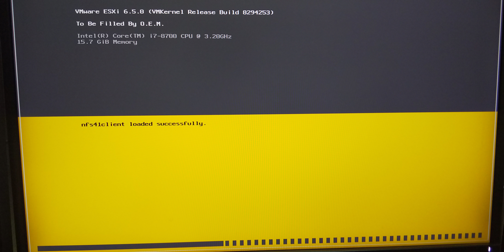

ロードが終わったらハードウェア互換性には気をつけろよ、サポートしないハードウェアは知らないぜと言われるので、Enterで進む。

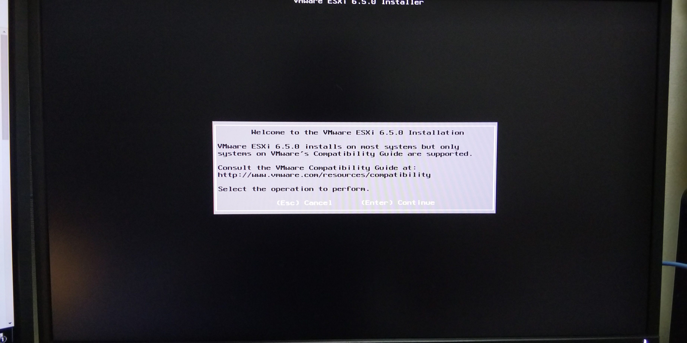

EULAに同意する。

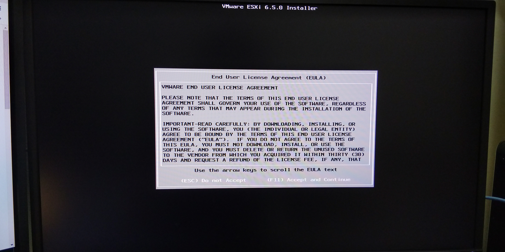

インストール先のドライブを選択する。SSDを選択。

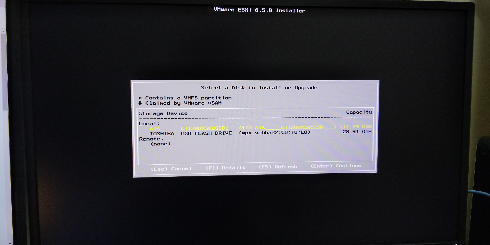

キーボードマッピングを選択する。

rootパスワードを設定。

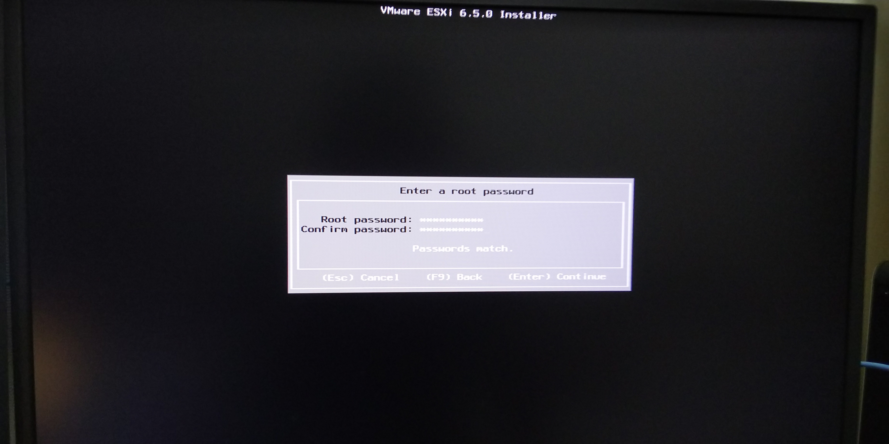

インストール先ディスクは完全に消去されてまうけどええんやなと聞かれるので、ええんやでを選択。

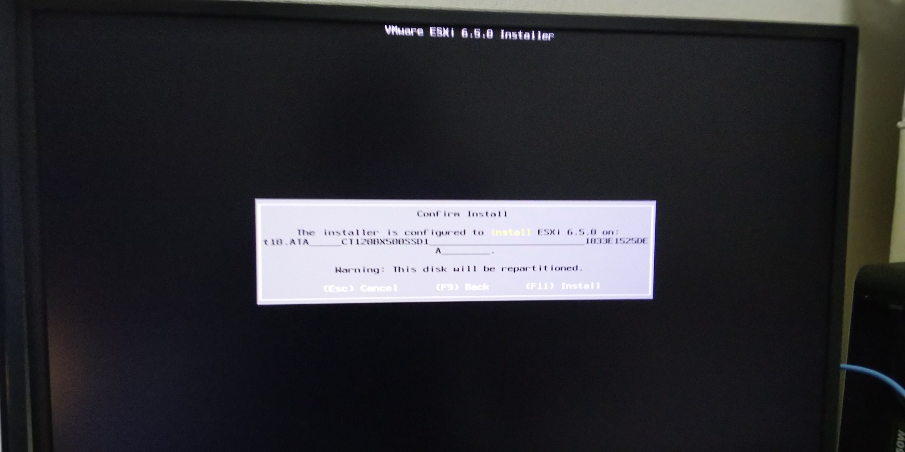

インストールが始まります。

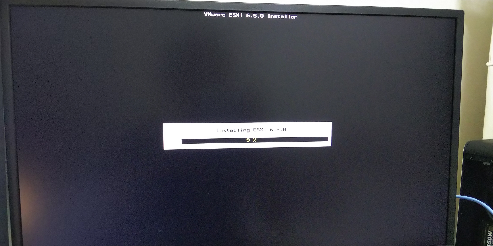

完了したら、USBメモリを取り外してからリブートしてくれよと言われるので、USBメモリを取り外しEnterを押す。そうすると勝手にリブートしてくれる。

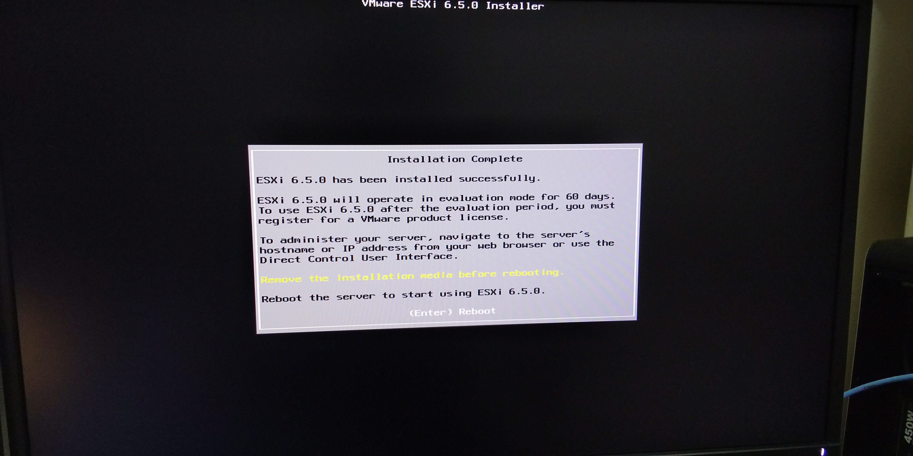

んでリブートして起動が終わると、ホーム画面が表示されます。インストール完了。無事に第一関門突破。

## ESXiの基本設定

起動した後に、F2キーを押すと設定画面に入れます。ログオンアカウント、パスワードを入力します。

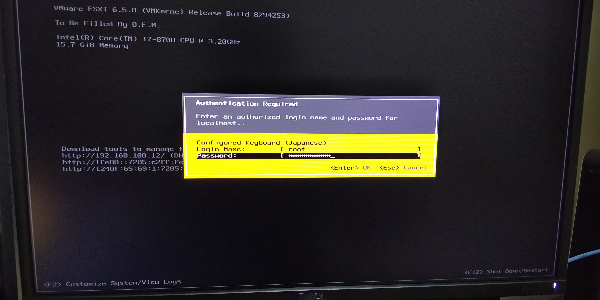

これが設定画面。NW設定やホスト名など基本的なことしか触れません。ちなみに実際に仮想マシンを作成したりするのは、ESXiシェル(sshでもOK)やvSphere Web Clientから行います。

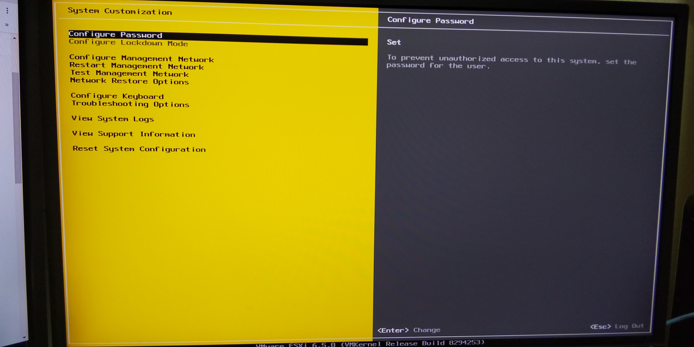

### Configure Management Network

｢Network Adapters｣から、マネジメントネットワークに利用するNICを選択します。マネジメントネットワークっていうのは、仮想マシンではなくESXi自体へアクセスする際のネットワーク。

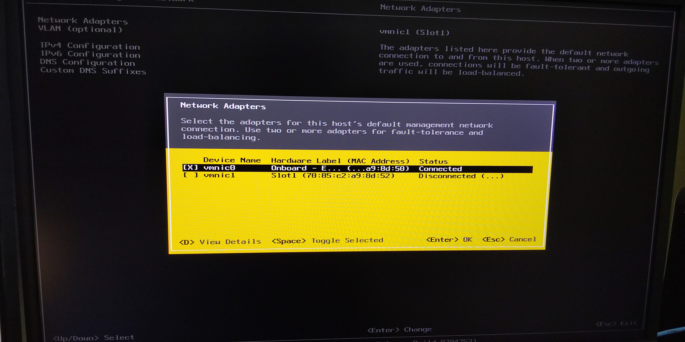

｢IPv4 Configuration｣からIPアドレス設定。静的IPアドレスを割り当てます。

｢IPv6 Configuration｣からIPv6は無効化します。

｢DNS Configuration｣から参照するDNSサーバを設定。なぜかESXi自身のホスト名もここで設定します。

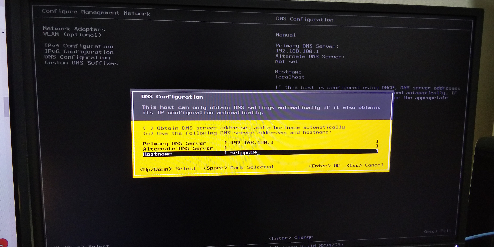

ここまで完了したらESCで抜ける。ホスト名の変更にはリブートが必要なので、自動的にリブートが行われます。

### Troubleshooting Options

ここからESXi Shellの有効化や、sshの有効化などができます。基本的にvSphere Web Clientで操作は完結しますが、細かい設定をいじるなど必要であれば、ここから有効化しておきます。

## ESXiのライセンス登録

ここまでできたら、ESXi機とディスプレイを切りはなしても大丈夫です。後は他のマシンから、ブラウザ経由でESXiの操作ができるvSphere Web Clientを利用します。これはESXiに内蔵されており、ブラウザでESXiのIPアドレスを指定するとアクセスできます。

初回アクセス時は証明書エラーが出ます。証明書エラーはアクセス先が間違いなく想定したアクセス先であるときのみ無視してください。なんでもかんでも無視するのはよくないです。

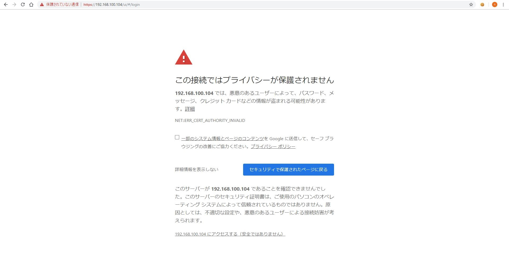

ログイン画面が表示されるので、ユーザIDとパスワードを入力します。

するとこんな管理コンソールが表示されます。

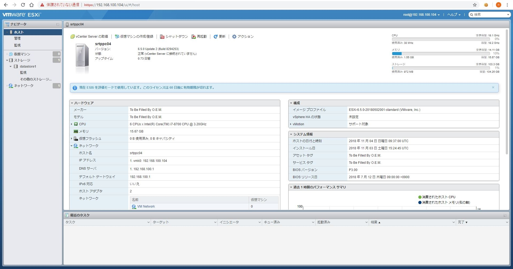

左ペインの｢管理｣から、上タブの｢ライセンス｣をクリック。ライセンスを登録していない状態では60日間のみの評価版の扱いですが、無償版のライセンスを登録すると、無期限になります(ただし機能は無償版の機能のみに制限されます。)。｢ライセンスの割り当て｣をクリック。

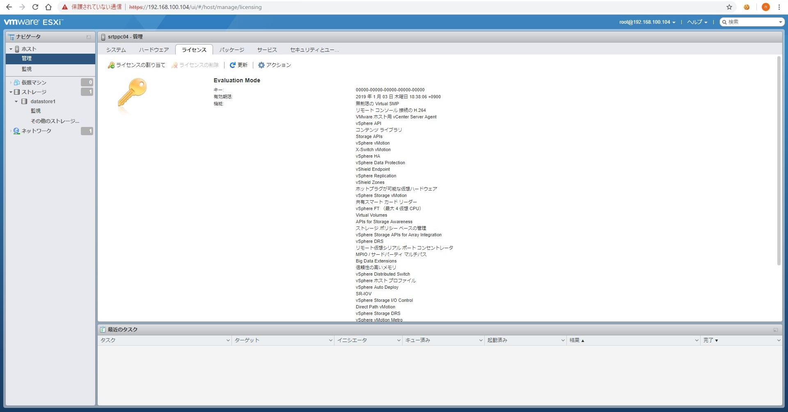

ライセンスを入力して｢ライセンスの確認｣をクリックする。

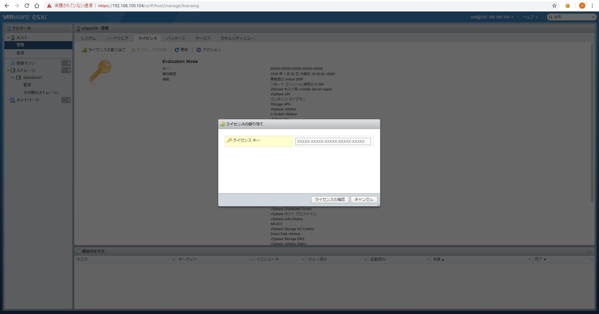

有効なライセンスコードであるかどうかが確認されるので、問題なければ｢ライセンスの割り当て｣をクリックする。

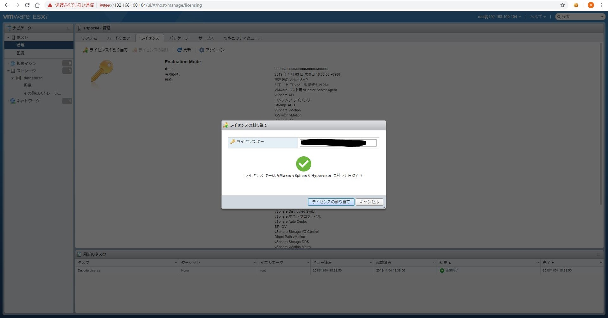

登録完了。無償版なのでめっちゃ機能少なくなりましたが、有償版の機能は複数のESXiホストを連携させるものが多いので、単なる単体のハイパーバイザとして使うのであれば、無償版でもさほど問題ないです。ただvCenter Serverだけは評価として使いたい……無償版にはないですが。

以上。仮想マシンの作成とかSANとのiSCSI接続とかはまた今度。
