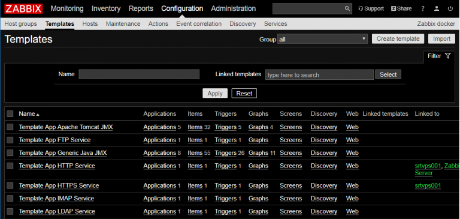
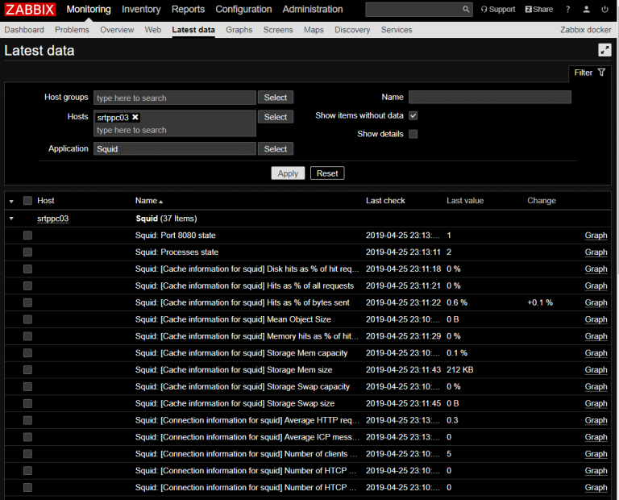

# {{this.$page.frontmatter.title}}

{{this.$page.frontmatter.description}}

<!--more-->

## 環境

ZabbixサーバはZabbix 4.0.3 (コマンドを打つのがめんどかったからGUIから確認しました)。以下監視対象のSquidサーバの環境。

```bash
$ lsb_release -a
No LSB modules are available.
Distributor ID: Ubuntu
Description:    Ubuntu 16.04.4 LTS
Release:        16.04
Codename:       xenial
$ squid -v
Squid Cache: Version 3.5.12
Service Name: squid
Ubuntu linux
configure options:
(~snip~)
$ zabbix_agentd --version
Zabbix Agent (daemon) v2.4.7 (revision 56694) (12 November 2015)
Compilation time: Jun 28 2016 00:03:29
```

## Zabbixテンプレートについて

アイテム、トリガ、アクションなどをひとまとめにしたもの。

* アイテム：監視対象のホストから収集する項目。具体例で言うとプロセス数、CPU使用率など。
* トリガ：アイテムの値に対する閾値の判定。プロセス数が300超えてないかどうかや、CPU使用率が75%超えてないか、など。数字以外に文字列もトリガにできる。アイテムの値が｢SUCCESS｣かどうか、など。
* イベント：トリガー判定結果の履歴
* アクション：イベントに対してZabbixが行う動作。CPU使用率75%超えが3分間続いたらメールを飛ばす、など。

何の項目をどうやって監視するかというのがテンプレートで、監視対象のホストにそのテンプレートをリンクしていく形で監視設定を行います。OSの基本的な監視項目などは、ビルトインのテンプレートがあるのですが、個々のアプリケーションに対する監視テンプレートはあんまりビルトインされていません。

## Zabbix ShareからSquidの監視テンプレートをダウンロード

Zabbix ShareというZabbixの監視テンプレートを共有するサイトがあります。

<https://share.zabbix.com/>

ここでSquidのテンプレートを探すと、SNMPでSquidを監視するテンプレートと、ZabbixエージェントでSquidを監視するテンプレートがあります。今回はエージェントのほうを利用します。

<https://share.zabbix.com/cat-app/squid-3-4-template>

｢Download｣をクリックして、ダウンロードされたzipファイルを解凍すると、以下の二つのファイルが入っています。

* `Squid_template_for_zabbix_agent_config.conf`
* `Template App Squid 2017-04-10.xml`

.confのほうを監視対象ホストに、.xmlをZabbixサーバにインポートします。テンプレートと呼ばれるのは.xmlファイルのほうです。

## テンプレートのインポート

ZabbixサーバのConfiguration → Templates画面の右上のImportをクリックします。



インポートするxmlファイルを選択して、何の項目をインポートするのか選択します。その後に何の項目をインポートするかチェックボックスで選択します。面倒ならCreate new全部にチェック入れてもいいと思います。


Configuration → Templates画面で、テンプレートがインポートされたことを確認します。｢Template App Squid｣という名前であると思います。

## テンプレートの修正

私はSquidのポート番号を、デフォルトの3128から8080に変更していたので修正します。Template App Squidをクリックし、Items → Squid: Port 3128 stateをクリックします。

そしたら、Nameのポート番号を8080に変更し、Keyのポート番号も8080に変更して保存します。


Zabbixサーバ側でテンプレートを修正するのはこれだけ。他のSquid状態監視アイテムのポート番号も編集しなくていいの？と思いますが、これだけで大丈夫です。

今回インポートしたテンプレートの監視アイテムが利用しているKeyは以下の通りです。

* Squid: `Port 8080 state` ： `net.tcp.listen[8080]`
* Squid: `Processes state` ： `proc.num[squid]`
* その他 ： `squid.*`

Zabbixサーバは、ZabbixエージェントにこのKeyのみを送信し、ZabbixエージェントはこのKeyと紐づくコマンドを実行し、結果をZabbixサーバに返却します。

`net.tcp.listen[XXX]`は、tcpXXX番ポートがTCPレベルでリッスンしているかどうかをエージェントが直接確認するため、直接ポート番号を編集して指定してあげる必要があります。一方、`proc.num[squid]` は｢squid｣と名の付くプロセスの数を直接確認するだけであるため。ポート番号は関係ありません。万一squidの実行ファイル名を変更していたら、ここも変えねばなりません。これらのKeyはZabbixデフォルトでKeyとコマンドの対応が定義されています。

参考：<https://www.zabbix.com/documentation/2.2/jp/manual/config/items/itemtypes/zabbix_agent>

また、そのほかの｢`squid.*`｣というKeyは、Zabbixデフォルトでは定義されていません。このKeyとコマンドの対応を、エージェントに教えてあげる必要があります。その対応表が、先ほどダウンロードした.confです。

## 独自監視Keyとコマンドの対応表をエージェントへ配布

先ほどダウンロードした`Squid_template_for_zabbix_agent_config.conf`の中身を見てみます。

```bash
#Squid 3.4 template

# Cache information for squid:
UserParameter=squid.disk_hits_as_of_hit_requests,squidclient mgr:info 2&gt;&1|grep 'Disk hits as % of hit requests:'|cut -d':' -f3|cut -d',' -f1|tr -d ' %'
UserParameter=squid.hits_as_of_all_requests,squidclient mgr:info 2&gt;&1|grep 'Hits as % of all requests:'|cut -d':' -f3|cut -d',' -f1|tr -d ' %'
UserParameter=squid.hits_as_of_bytes_sent,squidclient mgr:info 2&gt;&1|grep 'Hits as % of bytes sent:'|cut -d':' -f3|cut -d',' -f1|tr -d ' %'
UserParameter=squid.mean_object_size,squidclient mgr:info 2&gt;&1|grep 'Mean Object Size:'|cut -d':' -f2|awk '{print $1}'
UserParameter=squid.memory_hits_as_of_hit_requests,squidclient mgr:info 2&gt;&1|grep 'Memory hits as % of hit requests:'|cut -d':' -f3|cut -d',' -f1|tr -d ' %'
UserParameter=squid.storage_mem_capacity,squidclient mgr:info 2&gt;&1|grep 'Storage Mem capacity:'|cut -d':' -f2|awk '{print $1}'|tr -d ' %'
UserParameter=squid.storage_mem_size,squidclient mgr:info 2&gt;&1|grep 'Storage Mem size:'|cut -d':' -f2|awk '{print $1}'
UserParameter=squid.storage_swap_capacity,squidclient mgr:info 2&gt;&1|grep 'Storage Swap capacity:'|cut -d':' -f2|awk '{print $1}'|tr -d ' %'
UserParameter=squid.storage_swap_size,squidclient mgr:info 2&gt;&1|grep 'Storage Swap size:'|cut -d':' -f2|awk '{print $1}'

# Connection information for squid
UserParameter=squid.average_http_requests_per_minute_since_start,squidclient mgr:info 2&gt;&1|grep 'Average HTTP requests per minute since start:'|cut -d':' -f2| tr -d ' \t'
UserParameter=squid.average_icp_messages_per_minute_since_start,squidclient mgr:info 2&gt;&1|grep 'Average ICP messages per minute since start:'|cut -d':' -f2| tr -d ' \t'
UserParameter=squid.number_of_clients_accessing_cache,squidclient mgr:info 2&gt;&1|grep 'Number of clients accessing cache:'|cut -d':' -f2| tr -d ' \t'
UserParameter=squid.number_of_htcp_messages_received,squidclient mgr:info 2&gt;&1|grep 'Number of HTCP messages received:'|cut -d':' -f2| tr -d ' \t'
UserParameter=squid.number_of_htcp_messages_sent,squidclient mgr:info 2&gt;&1|grep 'Number of HTCP messages sent:'|cut -d':' -f2| tr -d ' \t'
UserParameter=squid.number_of_http_requests_received,squidclient mgr:info 2&gt;&1|grep 'Number of HTTP requests received:'|cut -d':' -f2| tr -d ' \t'
UserParameter=squid.number_of_icp_messages_received,squidclient mgr:info 2&gt;&1|grep 'Number of ICP messages received:'|cut -d':' -f2| tr -d ' \t'
UserParameter=squid.number_of_icp_messages_sent,squidclient mgr:info 2&gt;&1|grep 'Number of ICP messages sent:'|cut -d':' -f2| tr -d ' \t'
UserParameter=squid.number_of_queued_icp_replies,squidclient mgr:info 2&gt;&1|grep 'Number of queued ICP replies:'|cut -d':' -f2| tr -d ' \t'
UserParameter=squid.request_failure_ratio,squidclient mgr:info 2&gt;&1|grep 'Request failure ratio:'|cut -d':' -f2| tr -d ' \t'

# File descriptor usage for squid
UserParameter=squid.available_number_of_file_descriptors,squidclient mgr:info 2&gt;&1|grep 'Available number of file descriptors:'|cut -d':' -f2|awk '{print $1}'
UserParameter=squid.files_queued_for_open,squidclient mgr:info 2&gt;&1|grep 'Files queued for open:'|cut -d':' -f2|awk '{print $1}'
UserParameter=squid.largest_file_desc_currently_in_use,squidclient mgr:info 2&gt;&1|grep 'Largest file desc currently in use:'|cut -d':' -f2|awk '{print $1}'
UserParameter=squid.maximum_number_of_file_descriptors,squidclient mgr:info 2&gt;&1|grep 'Maximum number of file descriptors:'|cut -d':' -f2|awk '{print $1}'
UserParameter=squid.number_of_file_desc_currently_in_use,squidclient mgr:info 2&gt;&1|grep 'Number of file desc currently in use:'|cut -d':' -f2|awk '{print $1}'
UserParameter=squid.reserved_number_of_file_descriptors,squidclient mgr:info 2&gt;&1|grep 'Reserved number of file descriptors:'|cut -d':' -f2|awk '{print $1}'
UserParameter=squid.store_disk_files_open,squidclient mgr:info 2&gt;&1|grep 'Store Disk files open:'|cut -d':' -f2|awk '{print $1}'

# Median Service Times (seconds)
UserParameter=squid.cache_hits,squidclient mgr:info 2&gt;&1|grep 'Cache Hits:'|cut -d':' -f2|tr -s ' '|awk '{print $1}'
UserParameter=squid.cache_misses,squidclient mgr:info 2&gt;&1|grep 'Cache Misses:'|cut -d':' -f2|tr -s ' '|awk '{print $1}'
UserParameter=squid.dns_lookups,squidclient mgr:info 2&gt;&1|grep 'DNS Lookups:'|cut -d':' -f2|tr -s ' '|awk '{print $1}'
UserParameter=squid.http_requests_all,squidclient mgr:info 2&gt;&1|grep 'HTTP Requests (All):'|cut -d':' -f2|tr -s ' '|awk '{print $1}'
UserParameter=squid.icp_queries,squidclient mgr:info 2&gt;&1|grep 'ICP Queries:'|cut -d':' -f2|tr -s ' '|awk '{print $1}'
UserParameter=squid.near_hits,squidclient mgr:info 2&gt;&1|grep 'Near Hits:'|cut -d':' -f2|tr -s ' '|awk '{print $1}'
UserParameter=squid.not_modified_replies,squidclient mgr:info 2&gt;&1|grep 'Not-Modified Replies:'|cut -d':' -f2|tr -s ' '|awk '{print $1}'

# Resource usage for squid
UserParameter=squid.cpu_usage,squidclient mgr:info 2&gt;&1|grep 'CPU Usage:'|cut -d':' -f2|tr -d '%'|tr -d ' \t'
UserParameter=squid.maximum_resident_size,squidclient mgr:info 2&gt;&1|grep 'Maximum Resident Size:'|cut -d':' -f2|awk '{print $1}'
```

`UserParameter=<Key>,<Command>`という書式でKeyとコマンドの対応が書かれています。Commandを見ると、squidclientコマンドの結果をひたすらテキスト処理していくような形になっています。なので、squidclientコマンドをSquidサーバにインストールしておき、localhost内でsquidclientコマンドを利用して状態を取得できるよう設定しておく必要があります。

で、私のsquidはポートを8080に変更しているため、squidclientコマンド実行時にポートを指定する必要があります。全ての行に｢`-p 8080`｣を追加します。

```bash
#Squid 3.4 template

# Cache information for squid:
UserParameter=squid.disk_hits_as_of_hit_requests,squidclient -p 8080 mgr:info 2&gt;&1|grep 'Disk hits as % of hit requests:'|cut -d':' -f3|cut -d',' -f1|tr -d ' %'
(~snip~)
```

そしたらこのファイルをSquidサーバに配置し、Zabbixエージェントがそれを読めるようにしてあげます。`/etc/zabbix/zabbix_agentd.conf.d/`にこのファイルを保管し、`/etc/zabbix/zabbix_agentd.conf`に以下の行を追加し、Zabbixエージェントを再起動します。

```bash
Include=/etc/zabbix/zabbix_agentd.conf.d/*.conf
```

## Zabbixサーバから監視できていることを確認

ZabbixサーバのMonitoring → Latest DataからSquidが入っているホストを選択し、Squidの監視データが取れていることを確認出来たら完了です。



## 終わりに

Zabbixはネットでかじりながらいろいろ進めているので、ちゃんと本を読んで体系立った知識をつけたい。
