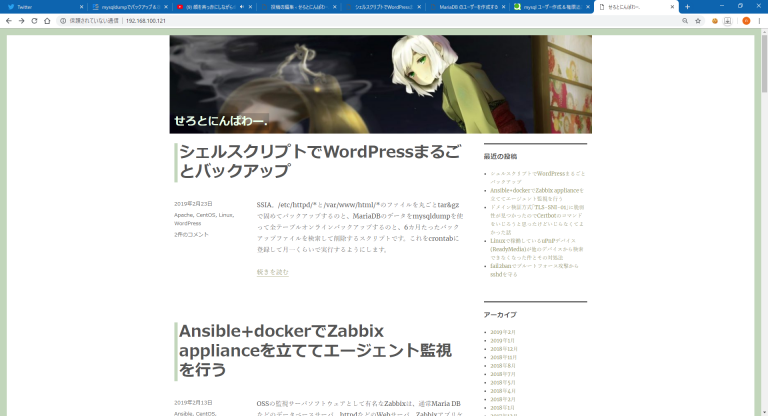

20190306 リストア手順について追記

SSIA。`/etc/httpd/*`と`/var/www/html/*`のファイルを丸ごとtar&gzで固めてバックアップするのと、MariaDBのデータをmysqldumpを使って全テーブルオンラインバックアップするのと、6カ月たったバックアップファイルを検索して削除するスクリプトです。これをcrontabに登録して月一くらいで実行するようにします。

<!--more-->

## wordpres_bak.sh

```bash
#!/bin/sh

httpdConfDir=/etc/httpd
varWwwHtmlDir=/var/www/html
backUpDate=`date +"%Y%m%d"`
backUpDir=/var/www/wordpres_bak/

###バックアップログファイル
backUpLogFile=${backUpDir}${backUpDate}.log

###/etc/httpd/*のバックアップ
backUpHttpdConf="tar -czvf ${backUpDir}etc_httpd_${backUpDate}.tgz -C ${httpdConfDir} . 2>&1 | tee -a ${backUpLogFile}"
echo \# ${backUpHttpdConf} > ${backUpLogFile}
eval ${backUpHttpdConf}
resultOfHttpdConf=$?

###/var/www/html/*のバックアップ
backUpVarWwwHtml="tar -czvf ${backUpDir}var_www_html_${backUpDate}.tgz -C ${varWwwHtmlDir} . 2>&1 | tee -a ${backUpLogFile}"
echo \# ${backUpVarWwwHtml} >> ${backUpLogFile}
eval ${backUpVarWwwHtml}
resultOfVarWwwHtml=$?

###MariaDBのバックアップ
#wp-config.phpからDBのユーザ名、パスワードを取得しtmpファイルに格納
dbUser=`grep DB_USER /var/www/html/wp-config.php | awk -F\' '{print $4}'`
dbPasswd=`grep DB_PASSWORD /var/www/html/wp-config.php | awk -F\' '{print $4}'`
cat << EOTMPMYCNF > .tmp.my.cnf
[mysqldump]
user=${dbUser}
password=${dbPasswd}
EOTMPMYCNF
#tmpファイルを利用してmysqldump実行
backUpMysql="mysqldump --defaults-file=.tmp.my.cnf --all-databases --events --opt | gzip > ${backUpDir}mysqldump_${backUpDate}.sql.gz"
echo \# ${backUpMysql} >> ${backUpLogFile}
eval ${backUpMysql}
resultOfMysqldump=$?
#tmpファイル削除
rm .tmp.my.cnf

###6カ月以上前のファイルを削除
#\や;のエスケープ忘れずに
findOldFiles="find ${backUpDir} -mtime 180"
echo \# ${findOldFiles} -exec ls -l {} \\\; >> ${backUpLogFile}
eval ${findOldFiles} -exec rm -f {} \\\;
resultOfRmOldFiles=$?

###実行結果のサマリをログファイル先頭に記載
#変数にサマリを格納。\nは後ほどのsedに改行だと解釈され、
#\は変数格納時の改行コードをエスケープする
resultOfAll="
---Summary---\n\
resultOfHttpdConf=${resultOfHttpdConf}\n\
resultOfVarWwwHtml=${resultOfVarWwwHtml}\n\
resultOfMysqldump=${resultOfMysqldump}\n\
resultOfRmOldFiles=${resultOfRmOldFiles}\n\
---Detail---
"
#\\は\記号をエスケープしている
sed -i "1i\\${resultOfAll}" ${backUpLogFile} 2>&1
```

## リストア

20190306追記。ローカル環境でリストアを行うため、ネットワークやSSL設定に関わるhttpd.confはリストアしません。WordPressのファイル群とDBのリストアを行います。

```bash
#環境構築(vagrantで構築した内容べた書き)
$ sudo yum install httpd php php-mysql mariadb mariadb-server -y
$ sudo sed -i -e 's/SELINUX=enforcing/SELINUX=disabled/g' /etc/selinux/config
$ sudo systemctl enable httpd mariadb
$ systemctl start httpd mariadb

#ここでいったんリブート。そして環境の確認
$ cat /etc/redhat-release
CentOS Linux release 7.6.1810 (Core)
$ httpd -v
Server version: Apache/2.4.6 (CentOS)
Server built:   Nov  5 2018 01:47:09
$ php -v
PHP 5.4.16 (cli) (built: Oct 30 2018 19:30:51)
Copyright (c) 1997-2013 The PHP Group
Zend Engine v2.4.0, Copyright (c) 1998-2013 Zend Technologies
$ mysql -V
mysql  Ver 15.1 Distrib 5.5.60-MariaDB, for Linux (x86_64) using readline 5.1

#mariadbのデータベース(ここではzzzz)、ユーザ作成
mysql -u root
MariaDB [(none)]> create database zzzz;
#シングルクオーテーション忘れずに
MariaDB [(none)]> create user '${ユーザ名}'@'localhost' identified by '${パスワード}';
MariaDB [(none)]> grant all on zzzz.* to '${ユーザ名}'@'localhost';
MariaDB [(none)]> exit

#ここでバックアップしたファイルをホームディレクトリにコピー
$ pwd
/home/vagrant
$ ls -l
total 79648
-rw-r--r-- 1 vagrant vagrant   353748 Feb 24 14:35 mysqldump_20190224.sql.gz
-rw-r--r-- 1 vagrant vagrant 81201872 Feb 24 14:35 var_www_html_20190224.tgz

#mariadbのリストア
$ gunzip mysqldump_20190224.sql.gz
$ ls
mysqldump_20190224.sql  var_www_html_20190224.tgz
$ mysql -u ${ユーザ名} -p < mysqldump_20190224.sql

#WordPressのコンテンツのリストア
$ sudo cp var_www_html_20190224.tgz /var/www/html
$ sudo tar xvfz var_www_html_20190224.tgz
```

## 動作確認

ブラウザからアクセス。ローカル環境にブログがリストアできました。ただしリンクは全部FQDNで記載されているため、リンク先もきちんとリストアできているか確認するためには、確認する端末のhostsファイルかなんかにFQDNと今回リストアを実施したサーバのローカルIPアドレスを書き込んでおく必要があります。



## 所感

だらだらブログ書くのはだらだら書くべきときだけにして、普段はこういう風にサクッと書くようにしたい。
