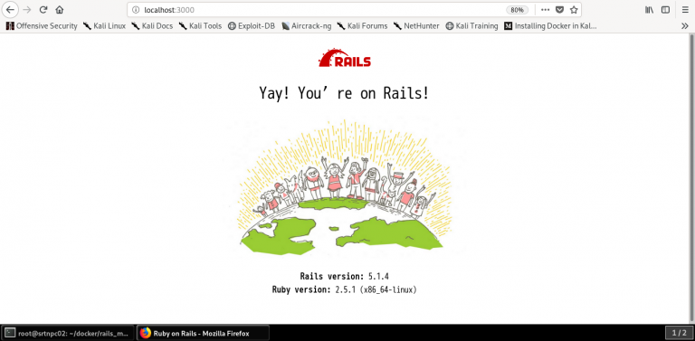

# {{this.$page.frontmatter.title}}

{{this.$page.frontmatter.description}}

<!--more もっと読む-->

## 環境

```bash
# lsb_release --all
No LSB modules are available.
Distributor ID: Kali
Description: Kali GNU/Linux Rolling
Release: 2019.1
Codename: n/a

# docker --version
Docker version 18.09.5, build e8ff056dbc

# docker-compose --version
docker-compose version 1.24.0, build 0aa59064
```

## Dockerイメージを探す

DockerHubにて。MySQLのDockerイメージはすぐに見つけられます。

<https://hub.docker.com/r/mysql/mysql-server>

RailsのDockerイメージもあるのかなぁと思って探したらdeprecatedでした。

<https://hub.docker.com/_/rails/>

RubyのDockerイメージをRails用にビルドして使ってねとの記載がありました。なので、DockerfileでRubyのDockerイメージをRails用にビルドして、docker-composeでそのRails用にビルドしたRubyコンテナとMySQLコンテナを立ち上げて連携させることにします。

## Rails用のディレクトリを作成する

適当な場所に。このディレクトリ内に以下の四つのファイルを作成します。

* Dockerfile
* docker-compose.yml
* Gemfile
* Gemfile.lock

## RubyイメージをRails用にビルドするDockerfile

Rubyのバージョンが2.5.1のイメージを使用します。バージョン上げたければ使用するDockerイメージを変更するだけで良いのがいいですね。

```bash
FROM ruby:2.5.1
ENV LANG C.UTF-8

RUN apt-get update -qq && apt-get install -y \
    build-essential \
    mysql-client \
    nodejs \
 && apt-get clean \
 && rm -rf /var/lib/apt/lists/*

RUN gem install bundler

WORKDIR /tmp
ADD Gemfile Gemfile
ADD Gemfile.lock Gemfile.lock
RUN bundle install

ENV APP_HOME /myapp
RUN mkdir -p $APP_HOME
WORKDIR $APP_HOME
ADD . $APP_HOME
```

`ADD . $APP_HOME` をする前にbundle installする理由は、Gemfileに変更がない場合に過去にビルド済みのDockerイメージをキャッシュとして利用することで、時間のかかるbundle installを行わなくて済むようにするためです。

<https://docs.docker.com/develop/develop-images/dockerfile_best-practices/#leverage-build-cache>

Dockerfileは上から下に処理されるため、キャッシュを効かせたい処理はなるべく上の方に書いた方がいいと理解しています。`ADD . $APP_HOME`をする前に、GemfileとGemfile.lockのみをコンテナの適当なディレクトリに配置してbundle installを行うようDickerfileに書いておくと、Gemfileに変更がない場合はこの処理をスキップし、過去のDockerイメージをキャッシュとして流用します。

逆に、`ADD . $APP_HOME` をした後にbundle installを走らせるようにDockerfileを記述すると、カレントディレクトリの何らかのファイル(Gemfile以外のファイルも)に変更があった時点でキャッシュが効かなくなり、必ずbundle installが走ってしまいます。

参考：<https://qiita.com/passol78/items/765ba4a5fa9c7c29972e>

なお、この書き方だと、`RUN apt-get`は必ずキャッシュされます。一度イメージをビルドした後にapt-getでコンテナにインストールしたパッケージをアップデートしたい場合は、`docker-compose build --no-cache`とno-cacheオプションをつけることでキャッシュを無視して完全に新規にビルドすることができます。

## docker-compose.yml

RailsのコンテナとMySQLのコンテナを立ち上げるdocker-compose.ymlを作成します。Railsのコンテナは前述の通りRubyのDockerイメージからDockerfileでビルドしたものを使います。MySQLは配布されているイメージそのまま。

```yaml
version: '3'
services:
  rails:
    build: .
    ports:
      - "3000:3000"
    command: bundle exec rails s -p 3000 -b '0.0.0.0'
    volumes:
      - .:/myapp
    depends_on:
      - db
  db:
    image: mysql:5.7
    environment:
      MYSQL_ROOT_PASSWORD: XXXXXXXX
    ports:
      - '3306:3306'
    volumes:
      - mysql_data:/var/lib/mysql
volumes:
  mysql_data:
```

railsの`build: .`は、カレントディレクトリのDockerfileをもとにビルドを行う、という意味です。

### volumesについて

`services -> rails -> volumes`では、カレントディレクトリをコンテナの/myappにマウントしています。これが前述のカレントディレクトリに存在するDockerfileやdocker-compose.yml、Gemfile、Gemfile.lock、およびRailsアプリケーションに利用するファイル/ディレクトリをマウントする設定です。

その次のmysql_data:というハッシュのキーでコンテナの/var/lib/mysqlにマウントを行う設定ですが、これは名前付きボリュームでMySQLのデータを永続化する設定です。特にホスト側のパスを意識する必要がなければ名前付きボリュームが便利です。コンテナを壊した後も他のコンテナからマウントできます。

参考：<http://docs.docker.jp/compose/compose-file.html#volumes-volume-driver>

## Gemfile

Railsを利用するため、使用したいRailsバージョンのみ書いておきます。bundle installでそれに依存するGem達が自動的に追記されます。

```ruby
source 'https://rubygems.org'

gem 'rails', '5.1.4'
```

## Gemfile.lock

bundle installで勝手に作成されるので空ファイルでいいですが、ファイル自体は作成しておきます。

## コンテナ経由でrails newする

Kali Linuxでやっているため都合ルートユーザですが、別にその必要はないです。bundle installはDockerfile側ですでに実行しており、かつコンテナの/usr/local/bundle以下にグローバルにGemをインストールしているため、rails newはbundle execでラップし、`--skip-bundle`オプションをつけます。Gemfileを上書きするが良いか聞かれるのが面倒なので、`--force`オプションもつけます。

```bash
# ls
Dockerfile Gemfile Gemfile.lock docker-compose.yml
# docker-compose run rails bundle exec rails new . --force --database=mysql --skip-bundle
```

終わると、Railsアプリケーションに必要なファイル/ディレクトリがコンテナによってホスト側のカレントディレクトリに作成されているのがわかります。

```bash
# ls
Dockerfile    README.md  bin        db                  log           test
Gemfile       Rakefile   config     docker-compose.yml  package.json  tmp
Gemfile.lock  app        config.ru  lib                 public        vendor
```

GemfileやGemfile.lockもこのタイミングで書き換えられています。

## MySQLへの接続設定

通常のRailsと一緒です。config/database.ymlにMySQLのホスト名とパスワードを記載します。ホスト名はdocker-compose.ymlのservicesでMySQLコンテナに付けた名前です。docker-composeで立てるコンテナは、同時に建てられた他のコンテナの名前をhostsファイルに自動的に指定してくれます。passwordはdocker-compose.ymlで指定したやつです。

```ruby
default: &default
  adapter: mysql2
  encoding: utf8
  pool: <%= ENV.fetch("RAILS_MAX_THREADS") { 5 } %>
  username: root
  password: XXXXXXXX
  host: db
```

## コンテナのビルド & 起動

```bash
# docker-compose build
# docker-compose up -d
```

## DB作成

```bash
# docker-compose run rails bundle exec rails db:create
```

ブラウザから起動確認しておわり。


## おわりに

環境を構築して満足しておわっていてはいけない。なんか作って勉強します。
