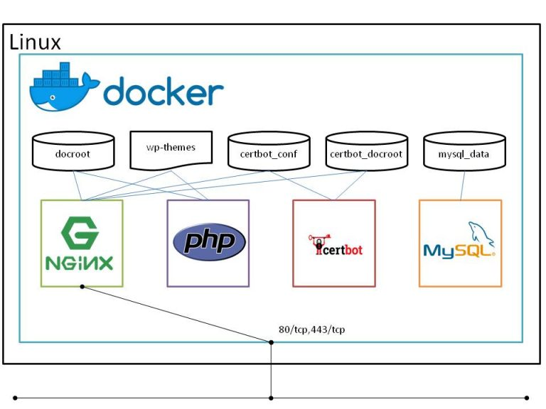

# {{this.$page.frontmatter.title}}

<Date/><ShowCategoriesOfPost/>

{{this.$page.frontmatter.description}}

<!--more-->

## 構成図

* ホストの80/tcp、443/tcpをnginxコンテナにマッピングし、webアクセスは全てnginxコンテナが受け付けます。
* WordPressはphp-fpmのイメージを利用してソースからビルドします。[WordPress公式のイメージもあります][1]が、日本語版のWordPressを使いたかったこと、WordPressのバージョンとphpのバージョンそれぞれを自分で柔軟に管理したかったため自分でビルドすることにしました。
* アセット類へのアクセスはnginxがそのままレスポンスを返します。`*.php`へのアクセスは、php-fpmコンテナへ`fastcgi_pass`します。そのためドキュメントルートはnginxとphp-fpmで共有します。
* WordPressのほとんどすべてのコンテンツはgit管理する必要がないため、名前付きvolumeでマウントしてホスト側にデータを永続化します。ただし、テーマはgit管理できるよう、bindマウントします。詳しくは後で述べます。
* 証明書は`Let’s Encrypt`を使います。運用には[certbotコンテナイメージ][2]を利用します。詳しくは後で述べます。

## ソースコード

こちら。使い方などは`README.md`に書いてあるので、このブログでははまった点、悩んだ点を書いていきます。

[https://github.com/uda-cha/wordpress_ja_docker][3]

## 証明書の運用をdockerでどう行うか

dockerで`Let’s Encrypt`の証明書を発行・運用するならcertbotコンテナほぼ一択でしょう。証明書と秘密鍵の保管方法は、certbotコンテナとnginxコンテナで同じ名前付きvolumeをマウントして、証明書更新時にnginxからシンボリックリンクの張替えを行えばOK。構成図でいうとcertbot_confで管理しています。

問題は証明書の作成方法と更新方法。今のところ、`Let’s Encrypt`のドメイン検証方式はそのドメインを運用するwebサーバ内で完結できるhttp-01で行っています。dns-01でやるのが多分一番楽ですが、なるべく一か所で管理したかった。

また、certbotコンテナはhttp-01のドメイン検証用のwebサーバとしても稼働できますが、私は完全にコマンドラインツールとしてのみ使用しています。

http-01は、証明書発行時に指定したドメインの`/.well-known/acme-challenge/`のディレクトリに、`Let’s Encrypt`から指定されたランダムな名前のファイルをcertbotが生成し、`Let’s Encrypt`が インターネット越しにそのファイルにアクセスしてきちんとコンテンツを取得できるかどうかで検証します。

どうやって`/.well-known/acme-challenge/`を外部に公開するかは、以下の二つの方法を思いつきましたが、とりあえず前者でやっています。前者は余計なマウントポイントが増えてうーんって感じなので、たぶんそのうち後者に変更します。ただ前者も前者でweb公開設定をnginx一か所で管理できるのが良いポイントなんですよね。

* certbotのwebサーバとしてのドキュメントルートをnginxと共有する(certbotをwebサーバとして外部に公開しない)
* nginxに対する`.well-known/acme-challenge/`へのアクセスのみ、webサーバとして稼働しているcertbotへ`proxy_pass`する

## WordPressのテーマを永続化させるとWordPressコンテナ破棄後に再作成した際に言語選択画面が表示されない

WordPressは初回インストール時に言語を選択できます。しかし、素のWordPressをソースコードを利用していて、かつWordPressのテーマディレクトリをbindマウントしてホスト側に永続している場合、一度WordPressを構築した後に`docker-compose down`してもう一度`docker-compse up -d`したときに、この言語選択画面が出てきませんでした。

PHPのコードを追いましたがよくわからなかったので、手っ取り早く日本語版のWordPressのソースコードを利用することにしました。うーん。

## タイムゾーンの変更めんどくさすぎ問題

ログの時系列を整理するために、コンテナのOSのタイムゾーンとアプリケーションのタイムゾーンそれぞれをAsia/Tokyoにしなければなりません。

OSのタイムゾーンは、docker-compose.ymlで環境変数`TZ`を指定して渡す例が多くネットに上がっていますが、その方法が使えるかどうかはきちんとそのDockerイメージの成り立ちを確認しなければなりません。alpineなら`tzdata`がインストールされているか、debian系なら`locales`がインストールされているかどうか。

また、コンテナ内で稼働するアプリケーションにもタイムゾーンを設定してあげる必要があります。nginxはOSのタイムゾーンを読んでくれるので楽。phpは`php.ini`で指定しなければいけないのでちょっと面倒。MySQL 5.7、おまえふざけんなよなんでデータベース自体のタイムゾーンはきちんとOSのタイムゾーン読んでくれるのに[ログのタイムスタンプのタイムゾーンだけデフォルト値がUTC][4]なんだよ1日返してくれ。

よく言われることですが、イギリスに住みたいですね。

## 最後に

今回作成したWordPress用コンテナ群は、今GCEで実際に運用しています。運用しながら課題をいろいろみつけて勉強していきたい。

今わかっている段階でもこまごました問題があって、githubのissueに積んでいっています。監視がまだできていないので、Zabbixエージェントで各コンテナのアプリケーションの状態、リソース状況、ホストのリソース状況をとれるようにもしたい。

ただあまりWordPressとdockerばかりやっている時間もなくて、勉強しなければいけないことが山積みでしんどい。みんなどうやって勉強してるんだろう。頭が悪いと時間が足りない。

 [1]: https://hub.docker.com/_/wordpress/
 [2]: https://hub.docker.com/r/certbot/certbot/
 [3]: https://github.com/uda-cha/wordpress_ja_docker
 [4]: https://dev.mysql.com/doc/refman/5.7/en/server-system-variables.html#sysvar_log_timestamps
